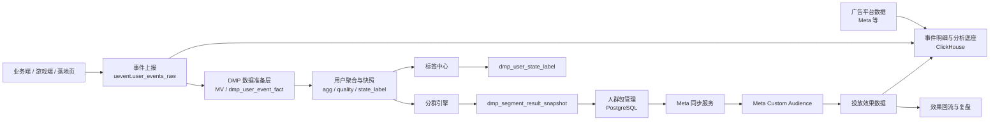
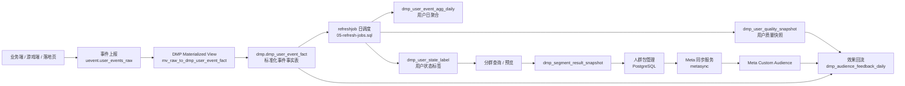

# 广告投放 DMP 平台技术方案

> **适用公司**：AZSL / 艾泽 / AITRI  
> **文档定位**：面向当前广告投放业务的轻量 DMP 技术方案，重点解决标签、分群、人群包、Meta 同步与效果回流  
> **适用阶段**：当前以 Meta 为主，后续可扩展到多渠道  
> **相关文档**：`ad-data-analytics-technical-plan.md` 负责分析底座，`ad-audience-package-design-plan.md` 作为历史归档与补充参考，本方案负责 DMP 平台形态与技术落地

---

## 一、背景、现状与问题

当前业务已经有一套统一事件采集入口，业务端 / 游戏端 / 落地页侧会按 `API-uevent.md` 将广告点击、安装、注册、付费和游戏内行为事件上报到事件系统。与此同时，相关分析数据主要进入 `ClickHouse`。公司当前以 Meta 投放为主，后续会扩展到更多渠道，并逐步建设自动化投放和平台化能力。

当前最核心的问题不是“有没有数据”，而是：

- 缺少统一的用户标签和分群平台
- 人群包构建、更新、复盘仍偏手工
- 事件系统接收到的点击、安装、注册、首充、活跃等事件，还没有稳定沉淀为 DMP 数据资产
- 人群包与投放效果之间缺少标准回流链路
- 当前不适合一上来做重型 CDP / 实时画像 / 跨渠道统一身份图谱

结合当前阶段要求，Phase 1 更适合围绕最小必要数据集建设 DMP，而不是追求大而全。

---

## 二、推荐结论

当前最适合 AZSL 的不是重型 DMP，而是一个 **基于 ClickHouse 分析底座的轻量 DMP 平台**。

推荐路线：

1. 先沉淀最小必要数据集
2. 再建设标签中心和分群引擎
3. 再建设人群包管理与 Meta 同步
4. 最后补效果回流、自动更新和智能扩展

当前阶段建议优先支撑以下能力：

- 用户标签与状态沉淀
- 标准人群包圈选
- Meta Customer List / Custom Audience 同步
- 人群包版本管理与复盘
- 与分析平台联动，评估匹配率、转化率、ROAS、LTV

不建议当前阶段直接建设：

- 重型实时 CDP
- 跨媒体全量统一 ID Graph
- 复杂实时特征平台
- 黑盒自动建包系统
- 一开始就做多渠道统一人群运营平台

---

## 三、方案边界

### 3.1 本方案包含

- DMP 平台定位与系统边界
- DMP 与自建事件采集系统的对接边界
- 最小必要数据集设计
- 标签中心、分群引擎、人群包管理
- Meta 同步链路
- 效果回流与复盘
- MVP 实施路线、资源、成本和风险

### 3.2 本方案不包含

- 全量 CRM / CDP 平台
- 复杂实时画像引擎
- 跨渠道统一身份图谱
- 站内全域营销自动化
- DSP 全能力建设

---

## 四、方案设计

### 4.1 系统定位

DMP 在当前阶段是“事件数据底座 + 分析平台”之上的人群运营层，负责把事件数据资产转成可执行的人群资产。当前实现为单一 Go 服务，消费 ClickHouse 中的事件明细并通过内置调度产出用户标签、分群结果和人群包。



### 4.2 一级模块

- **事件消费与数据建模层**
  - 通过 ClickHouse Materialized View 从 `uevent.user_events_raw` 实时解析标准化为 `dmp.dmp_user_event_fact`
  - 生成用户日聚合表 `dmp.dmp_user_event_agg_daily`、用户质量快照 `dmp.dmp_user_quality_snapshot`
- **内置刷新调度层 (refreshjob)**
  - Go 内置调度器，支持 daily / hourly / interval 三种模式
  - 执行 `05-refresh-jobs.sql` 完成日聚合、快照、标签计算、分群结果产出
  - 支持增量运行参数（RUN_DATE、RUN_APP_ID、RUN_BUCKET_COUNT 等）
- **标签中心**
  - 标签定义（`dmp_tag_definition`）、标签业务规则（`dmp_business_tag_rule_definition`）、用户状态标签结果（`dmp_user_state_label`）
- **分群引擎**
  - 规则分群、时间窗口、交并差集、排除逻辑，查询 `dmp_user_state_label` 和 `dmp_user_quality_snapshot`
- **人群包管理**
  - 人群包定义（`dmp_segment_definition`）、导出 CSV、同步记录、版本与状态追踪
- **Web 管理界面**
  - Go 内嵌 HTML（`admin_page.go`）的单页后台，支持鉴权登录、标签/分群/人群/任务管理
- **渠道同步层**
  - Meta Audience 上传、更新、删除、失败重试
- **效果回流层**
  - 匹配率、包规模、投放表现、回收表现、包复盘（`dmp_audience_feedback_daily`）

#### 4.2.1 DMP 与事件系统的边界

- 事件系统负责“接收上报”，即对外提供统一采集接口并完成接入层校验
- DMP 负责“消费与应用”，即基于事件系统的落库结果做标准化、聚合、标签、分群和同步
- DMP 默认不直接对接业务方自己的底层埋点库或订单库
- 若后续存在业务库补数需求，也应优先按 `API-uevent.md` 口径补齐后再进入 DMP 计算链路

#### 4.2.2 推荐实现方案

当前最推荐的实现方式不是把 DMP 和事件系统做成一个“大一统服务”，而是做成 **同一数据底座上的两个相邻系统**：

- 事件系统做稳定接入层
- DMP 做稳定消费层和应用层
- 两者通过原始接入表、标准事件表和配置表解耦
- 事件系统优先保证“正确接住事件”
- DMP 优先保证“稳定产出标签、人群包和复盘结果”

推荐原因：

- 事件接入链路和 DMP 计算链路的变化节奏不同，不适合强耦合
- 接口鉴权、签名、限流、幂等、回放等能力更适合沉淀在事件系统
- 标签、分群、受众同步、效果回流更适合沉淀在 DMP
- 后续即使新增 Google / TikTok / DSP 受众同步，DMP 也可以继续复用，而不用改动接入层

补充边界：

- `API-uevent.md` 是事件采集系统对业务方、游戏侧、落地页侧开放的统一事件上报协议
- DMP 不直接对外暴露业务事件写入接口，而是消费事件系统已经落库的标准入口结果

#### 4.2.3 推荐分工

| 系统 | 主要职责 | 不建议承担 |
|-----|------|------|
| 事件采集系统 | 对外开放 `API-uevent.md` 接口、鉴权签名、限流、幂等去重、原始落库、基础校验、失败重试、回放能力 | 复杂标签计算、分群规则、受众包管理、Meta 同步编排 |
| DMP | 标准化消费、身份归并、用户聚合、质量快照、标签中心、分群引擎、人群包管理、Meta 同步、效果回流 | 对外直接承接高并发业务事件上报、复杂签名校验链路 |
| 分析 / BI 平台 | 通用指标、报表、看板、诊断、复盘分析 | 直接承载 DMP 标签管理和人群包执行流程 |

一句话说：

- 事件系统解决“事件怎么可靠进来”
- DMP 解决“事件怎么变成人群资产”
- BI 解决“结果怎么被看懂和复盘”

#### 4.2.4 推荐技术对接方式

Phase 1 最推荐采用 **库表解耦 + 调度消费**，而不是服务间强同步调用。

推荐链路（当前实现）：

```text
业务 / 游戏 / 落地页
    -> `API-uevent.md` 上报接口
    -> 事件系统 ClickHouse 原始事件表 `uevent.user_events_raw(_local)`
    -> DMP 通过 Materialized View 实时标准化为 `dmp.dmp_user_event_fact`
    -> refreshjob 日调度生成 `dmp.dmp_user_event_agg_daily`
    -> refreshjob 日调度生成 `dmp.dmp_user_quality_snapshot`
    -> refreshjob 日调度生成 `dmp.dmp_user_state_label`
    -> 分群查询生成 `dmp.dmp_segment_result_snapshot`
    -> 导出 CSV 并同步 Meta
```

推荐做法：

- **交接层**：事件系统将原始事件落入 `uevent.user_events_raw`，DMP 通过 Materialized View 消费该表产出 `dmp.dmp_user_event_fact`
  - MV `dmp.mv_raw_to_dmp_user_event_fact_local` 实时完成 properties 解析、身份归并、字段标准化
- **计算层**：日内通过 refreshjob（Go 内置调度）执行 `05-refresh-jobs.sql`，按日批模式产出聚合、快照、标签
- **任务触发方式**：
  - 日批为主（默认 `daily` 模式，每天 01:05 执行）
  - 支持 `hourly` / `interval` 模式按需切换
  - 支持 `{{RUN_DATE}}`、`{{RUN_APP_ID}}` 等模板变量实现增量运行
- **配置交互方式**：统一放 `PostgreSQL`
  - 包括标签规则、阈值、分群定义、同步任务配置、应用配置、用户权限

不推荐做法：

- 事件系统收到一条事件后，立刻同步 RPC 调 DMP 进行标签计算
- 让 DMP 直接连业务方多个 MySQL / PostgreSQL / 埋点库逐个拉数
- 让事件系统内部直接承载大量标签、分群和受众同步逻辑

#### 4.2.5 推荐部署与技术栈

推荐按下面方式组织：

- **DMP 服务层**
  - `Go` 单一服务，使用 `Gin` 框架
  - 集成 Web 管理界面（内嵌 HTML + 原生 JS）、REST API、内置 refreshjob 调度器、Meta 同步客户端
  - Nginx 反代到 Go 服务（端口 8081）
- **ClickHouse**
  - `uevent` 数据库：原始事件明细（`user_events_raw`、`user_events_dwd_lite`）、用户特征（`user_features_latest`）、用户身份（`user_identity_latest`）、受众相关表
  - `dmp` 数据库：DMP 结果表（`dmp_user_event_fact`、`dmp_user_event_agg_daily`、`dmp_user_quality_snapshot`、`dmp_user_state_label`、`dmp_segment_result_snapshot`）
  - 冷热分层存储策略（hot → cold → archive）
- **PostgreSQL**
  - 应用配置（`dmp_business_app`）、用户与权限（`dmp_admin_user`、`dmp_admin_session`）
  - 标签定义（`dmp_tag_definition`）、业务规则（`dmp_business_tag_rule_definition`）
  - 分群定义（`dmp_segment_definition`）、人群模板（`dmp_audience_template`）
  - 人群包（`dmp_audience_package`）、任务（`dmp_task_job`）、同步（`dmp_audience_sync_task`、`dmp_audience_sync_result`）
  - 回流效果（`dmp_audience_feedback_daily`）
- **调度层**
  - Go 内置 `refreshjob.Runner`，不依赖 Airflow / Cron
  - 支持 daily / hourly / interval 模式，通过 PostgreSQL 实现分布式锁
  - SQL 模板变量注入（RUN_DATE、RUN_APP_ID、RUN_BUCKET_COUNT 等）
- **外部同步层**
  - Go 内置 `metasync` 客户端，直接操作 Meta Graph API
  - 避免外部 API 重试逻辑塞进标签计算任务

#### 4.2.6 整体系统架构说明



#### 4.2.7 分阶段建议

| 阶段 | 事件系统重点 | DMP 重点 | 当前状态 |
|-----|------|------|------|
| MVP | 接口稳定、签名校验、原始落库、幂等去重、回放能力 | 标准事实表、用户聚合、8-12 个核心标签、标准人群包、Meta 同步 | ✅ 已完成 |
| 可用版 | 补字段校验、错误监控、补数机制、标准事实表输出 | 标签版本化、分群模板、包级复盘、失败重试、规则配置化、Web 管理界面 | ✅ 已完成 |
| 标准版 | 增强多应用隔离、扩展更多事件、支持更稳的回放与补算 | 多渠道受众同步、更多价值标签、自动更新、策略联动 | 🔨 进行中 |

### 4.3 Phase 1 最小必要数据集

第一阶段建议只存 6 类核心数据：

1. **广告点击 / 曝光上下文**
   - 对应 `ad_click` / `ad_impression`
   - 渠道、账户、Campaign、素材、国家、时间、点击标识
2. **安装与首开**
   - 对应 `install` / `first_open`
   - 安装时间、首开时间、设备标识、包版本、归因来源
3. **注册 / FTD / 二次关键事件**
   - 对应 `register` / `first_deposit` / `deposit` / `enter_game` / `bet`
   - 注册、首充、复充或其他关键业务事件
4. **用户质量快照**
   - 早期付费、留存、活跃、作弊风险、LTV 初步判断
5. **用户状态标签**
   - 新用户、已注册未付费、首充用户、沉默用户、高价值用户等
6. **归因质量与可信度**
   - 归因方式、可信度、缺失情况、冲突标记

### 4.4 Phase 1 数据原则

- 只保留能直接支持标签、分群、建包、回流的数据
- 优先事件级和用户级结果，不追求一开始存全量画像
- 先把点击、安装、注册、首充、质量判断串起来
- 先支持 Meta，不急于多渠道同时做

### 4.5 核心链路

```text
广告点击 / 曝光
    -> 安装 / 首开
    -> 注册 / 首充 / 关键事件
    -> 用户质量快照
    -> 用户状态标签
    -> 分群规则命中
    -> 生成人群包
    -> Meta 同步
    -> 投放结果回流
    -> 人群包效果复盘
```

### 4.6 Phase 1 要解决的 3 个问题

Phase 1 不追求做成完整 DMP 平台，重点先解决下面 3 个问题：

1. **能不能把广告点击到业务关键事件串起来**
   - 至少要能把点击 / 安装 / 注册 / 首充 / 二次关键事件放到同一条分析链路里
2. **能不能稳定产出用户质量快照和状态标签**
   - 至少要能稳定产出注册状态、付费状态、活跃状态、沉默状态、高价值和高留存等结果
3. **能不能把这些结果真正用于人群包和效果复盘**
   - 至少要能做人群圈选、Meta 同步、包级表现回流和版本复盘

如果这 3 个问题没有解决，即使有很多表和很多字段，也不能算 Phase 1 做成了。

### 4.7 Phase 1 六类数据最小字段集

当前阶段建议按“够用即可”的原则定义最小字段，不追求一开始大而全。

#### 4.7.1 广告点击 / 曝光上下文

最少建议包含：

- `event_id`
- `app_id`
- `event_time`
- `event_type`
- `click_id`
- `pixel_id`
- `channel`
- `campaign_id`
- `ad_id`
- `platform`
- `country_code`
- `device_id`
- `properties.click_time / properties.impression_time`
- `properties.landing_page_url`
- `properties.utm`
- `properties.ad_info.account_id / adset_id / creative_id`

说明：

- `API-uevent.md` 顶层没有单独的 `impression_id` 字段，曝光侧建议使用 `event_id + pixel_id + event_time` 作为主去重与追踪基础
- 广告账户、广告组、创意等扩展维度优先从 `properties.ad_info` 取
- `ad_click` / `ad_impression` 只代表业务方可控范围内的触点，不等同于媒体平台完整日志

#### 4.7.2 安装与首开

最少建议包含：

- `event_id`
- `app_id`
- `event_type`
- `event_time`
- `device_id`
- `user_id`
- `click_id`
- `platform`
- `country_code`
- `properties.anonymous_id`
- `properties.session_id`
- `properties.install_type`
- `properties.utm`

说明：

- `install` / `first_open` 的主时间统一优先取顶层 `event_time`
- 匿名阶段关联优先使用 `device_id + anonymous_id / session_id`

#### 4.7.3 注册 / FTD / 二次关键事件

最少建议包含：

- `event_id`
- `app_id`
- `event_type`
- `event_time`
- `user_id`
- `device_id`
- `click_id`
- `platform`
- `country_code`
- `properties.phone / properties.email`
- `properties.phone_sha256 / properties.email_sha256`
- `properties.amount / properties.currency`
- `properties.deposit_index`
- `properties.game_id`
- `properties.start_time / properties.end_time`
- `properties.count / properties.gameInfo`

说明：

- `FTD` 在接口层应对应 `first_deposit`，不建议在原始事件层再造一个新的事件名
- `deposit` 表示后续充值，是否首充应优先以 `event_type` 判断，必要时再结合 `deposit_index`
- `bet` 是聚合事件，不是逐笔下注明细，更适合做活跃度和游戏偏好标签

#### 4.7.4 用户质量快照

最少包含（当前 `dmp.dmp_user_quality_snapshot` 实际字段）：

- `snapshot_date`
- `app_id`
- `person_id`（canonical 用户主键）
- `person_id_type`（user / device / anonymous）
- `user_id`（原始注册用户 ID）
- `register_time`
- `first_deposit_time`
- `deposit_amount_7d`
- `deposit_amount_30d`
- `active_days_7d`
- `retention_d2`
- `retention_d7`
- `ltv_30d`
- `risk_flag`
- `last_active_time`
- `last_country_code`
- `last_language_tag`
- `email` / `phone`
- `ad_device_id` / `ad_device_id_type`
- `email_sha256` / `phone_sha256`
- `has_ad_device_id` / `has_email_sha256` / `has_phone_sha256`
- `has_phone` / `has_push_token`
- `match_key_types`
- `is_exportable`

#### 4.7.5 用户状态标签

最少包含（当前 `dmp.dmp_user_state_label` 实际字段）：

- `snapshot_date`
- `app_id`
- `person_id`
- `person_id_type`
- `user_id`
- `lifecycle_state`
- `pay_state`
- `activity_state`
- `value_level`
- `quality_level`
- `identity_state`
- `matchability_state`
- `source_tag`
- `source_quality_tag`
- `language_tag`
- `has_phone`
- `has_push_token`
- `channel_reachability_hint`
- `device_tag`

#### 4.7.6 归因质量与可信度

最少建议包含（当前在 `dmp.dmp_user_event_fact` 中通过 `person_id_type` / `is_valid_identity` / `is_valid_json` 等字段部分覆盖）：

- `person_id`
- `person_id_type`
- `click_id` / `pixel_id`
- `is_valid_identity` / `is_valid_json`
- 完整归因质量表 `dmp_user_attribution_quality` 作为后续扩展项

#### 4.7.7 字段对齐原则

- DMP 结果表以 `person_id` 作为 canonical 用户主键（格式：`u:{app_id}:{user_id}`、`d:{app_id}:{device_id_type}:{device_id}`、`a:{app_id}:{anonymous_id}`）
- `user_id` 作为原始注册用户 ID 保留在结果表和聚合表中
- 国家字段统一使用 `country_code` / `last_country_code`
- 时间字段统一使用顶层 `event_time`，并保留 RFC3339 时区信息
- 事件扩展字段统一从 `properties` 解析，由 Materialized View 完成标准化
- 联系方式和设备匹配字段同时保留原始值和 SHA-256 值（`email_sha256` / `phone_sha256`）
- `person_id_type` 标识用户归并状态（user / device / anonymous）

### 4.8 数据粒度总结

Phase 1 实现中已明确 5 个主要粒度（均在 ClickHouse `dmp` 数据库）：

| 粒度 | 代表表 | 作用 |
|-----|------|------|
| **事件粒度** | `dmp.dmp_user_event_fact` | 保留标准化事件明细，已解析 properties + 已做身份归并 |
| **日聚合粒度** | `dmp.dmp_user_event_agg_daily` | 按 app_id + person_id + stat_date 汇总注册/活跃/充值/来源指标 |
| **用户快照粒度** | `dmp.dmp_user_quality_snapshot` | 汇总用户在某一时点的质量结果、身份信息、匹配键和可导出性 |
| **标签结果粒度** | `dmp.dmp_user_state_label` | 存某一时点用户的标签、状态和触达能力（含 lifecycle_state / has_phone / channel_reachability_hint 等） |
| **分群结果粒度** | `dmp.dmp_segment_result_snapshot` | 存某次分群规则命中的用户结果快照，冗余标签字段便于直接导出 |
| **配置与管理粒度（PostgreSQL）** | `dmp_segment_definition`、`dmp_audience_package` 等 | 存导包、同步和复盘所对应的包版本元数据 |

不建议一开始混用粒度，否则后面很难复盘。

### 4.9 事件数据如何产出用户标签与状态

核心链路：事件通过 Materialized View 实时标准化为事实表，再由 refreshjob 日调度产出聚合、快照、标签。

当前实现的链路如下：

```text
业务端 / 游戏端 / 落地页
    -> `API-uevent.md` 事件上报接口
    -> ClickHouse uevent.user_events_raw（原始落库）
    -> dmp.mv_raw_to_dmp_user_event_fact（Materialized View 实时标准化）
        - 解析 properties 中的 ad_device_id、email_sha256、phone_sha256、first_name 等
        - 计算 provisional_person_id（u:{app}:{uid} / d:{app}:{type}:{did} / a:{app}:{anonid}）
        - 提取 utm_*、ad_info.*、landing_page_url、install_type 等
    -> dmp.dmp_user_event_fact（标准化事件事实表）
    -> refreshjob 日调度（05-refresh-jobs.sql）
        步骤1: dmp_user_event_agg_daily（日聚合：注册/活跃/充值/身份归并统计）
        步骤2: dmp_user_quality_snapshot（质量快照：留存/付费/LTV/匹配键/可导出性）
        步骤3: dmp_user_state_label（状态标签：生命周期/价值/质量/来源/触达能力）
    -> 分群查询 / HTTP API 预览 / 导出 CSV
    -> Meta 同步与回流
```

具体分 2 层：

1. **实时层（Materialized View）**
   - 事件系统按 `API-uevent.md` 将原始事件落入 `uevent.user_events_raw`
   - DMP 的 MV `dmp.mv_raw_to_dmp_user_event_fact_local` 订阅该表，实时完成 properties 解析、字段标准化、身份归并
   - 统一 `event_type`、`event_time`、`country_code`、`channel`、`platform` 等顶层字段
   - 统一解析 `properties` 中的 `amount`、`currency`、`game_id`、`utm`、`ad_info`、`anonymous_id`、`session_id`
   - 生成 `provisional_person_id` 和 `person_id_type`
2. **调度层（refreshjob）**
   - 日批模式（daily）读 `dmp.dmp_user_event_fact`，产出日聚合、质量快照、状态标签
   - 支持 `hourly` / `interval` 模式按需切换
   - 通过 `RUN_DATE` / `RUN_APP_ID` / `RUN_BUCKET_COUNT` 等模板参数控制增量范围

#### 4.9.1 API 事件到 DMP 能力映射

| DMP 环节 | 对应 `event_type` | 主要字段 |
|-----|------|------|
| 触点上下文 | `ad_click` / `ad_impression` | `click_id`、`pixel_id`、`channel`、`campaign_id`、`ad_id`、`utm_*`、`ad_info.*` |
| 安装与首开 | `install` / `first_open` | `device_id`、`event_time`、`anonymous_id`、`session_id`、`install_type` |
| 注册身份确立 | `register` | `user_id`、`device_id`、`click_id`、`phone/email`、`phone_sha256/email_sha256` |
| 首充与付费价值 | `first_deposit` / `deposit` | `user_id`、`amount`、`currency`、`deposit_index` |
| 活跃与内容偏好 | `app_open` / `enter_game` / `bet` | `event_time`、`game_id`、`start_time_ms/end_time_ms/event_count` |

#### 4.9.2 API 边界说明

- `API-uevent.md` 是我们自建事件采集系统对业务 / 游戏开放的统一接入协议
- DMP 默认消费的是这套事件系统的落库结果，而不是直接消费业务方原始底表
- `ad_click` / `ad_impression` 只覆盖业务方可控范围内的点击和曝光
- 媒体平台完整的展示、点击、花费、竞价结果仍应从媒体 API 或 MMP 获取
- 因此 DMP 中的触点链路可用于站内漏斗和归因增强，但不能替代完整媒体投放报表

### 4.10 标签与状态计算规则

当前系统通过 refreshjob 执行 `05-refresh-jobs.sql` 产出标签，核心计算基于 `dmp_user_quality_snapshot` 和 `dmp_user_event_fact`。

**生命周期（lifecycle_state）计算逻辑（来自 refreshjob SQL）：**

```sql
multiIf(
  person_id_type != 'user', 'installed_not_registered',
  isNull(first_deposit_time), 'registered_not_paid',
  total_deposit_event_cnt > 1, 'repeat_deposit_user',
  'first_deposit_user'
)
```

**来源标签（source_tag）：**
- organic_source / telegram_source / web_source / unknown_source / paid_source
- 基于 `dmp_user_event_fact` 中按 `person_id` 取 `argMin(channel, event_time)` 判断首次来源

**来源质量标签（source_quality_tag）：**
- `low_quality_source`：付费渠道 AND 已注册非设备态 AND active_days_7d <= 1 AND deposit_amount_7d = 0 AND retention_d2 = 0 AND retention_d7 = 0
- 其余为 `normal_source`

**触达能力标签：**
- `has_phone`：`phone != '' OR phone_sha256 != ''`
- `has_push_token`：`user_id != ''`（已注册用户视为可达 Push）
- `channel_reachability_hint`：`multi_channel` / `push_only` / `phone_only` / `unreachable`

**设备标签（device_tag）：**
- android_device / ios_device / web_device / unknown_device
- 基于 `ad_device_id_type` 和首次 `platform` / `channel` 判断

**activity_state / value_level / quality_level**：通过 `{{ACTIVITY_STATE_EXPR}}`、`{{VALUE_LEVEL_EXPR}}`、`{{QUALITY_LEVEL_EXPR}}` SQL 模板变量注入，可在 PostgreSQL `dmp_business_tag_rule_definition` 中配置规则后由系统动态渲染

### 4.11 当前实现计算口径参考

以下为核心标签在 `05-refresh-jobs.sql` 中的实际 SQL 实现小结，供营销中台和复盘参考：

| 标签或状态 | 计算方式（来自 refreshjob SQL） |
|-----|------|
| `installed_not_registered` | `person_id_type != 'user'` |
| `registered_not_paid` | `person_id_type = 'user' AND isNull(first_deposit_time)` |
| `first_deposit_user` | `person_id_type = 'user' AND first_deposit_time IS NOT NULL AND total_deposit_event_cnt = 1` |
| `repeat_deposit_user` | `person_id_type = 'user' AND total_deposit_event_cnt > 1` |
| `source_tag` | `argMin(channel, event_time)` 判断首次来源：organic/telegram/web/paid/unknown |
| `source_quality_tag` | 付费渠道 AND 已注册 AND active_days_7d<=1 AND deposit_amount_7d=0 AND retention_d2=0 AND retention_d7=0 → low_quality_source |
| `has_phone` | `phone != '' OR phone_sha256 != ''` |
| `has_push_token` | `user_id != ''` |
| `channel_reachability_hint` | `multi_channel` / `push_only` / `phone_only` / `unreachable`（基于 has_push_token AND has_phone） |
| `device_tag` | 基于 ad_device_id_type 和首次 platform/channel：android/ios/web/unknown |

阈值和 activity_state / value_level / quality_level 通过 `{{ACTIVITY_STATE_EXPR}}` 等模板变量注入，可在 `dmp_business_tag_rule_definition` 中配置后动态渲染。

### 4.12 推荐表结构与职责

当前实现已按 `dmp` 数据库组织以下 ClickHouse 结果表，并在 PostgreSQL 中管理配置与任务：

**ClickHouse `dmp` 数据库（DMP 结果层）：**

1. **`dmp.dmp_user_event_fact`（标准化事件事实表）**
   - 由 MV `dmp.mv_raw_to_dmp_user_event_fact_local` 从 `uevent.user_events_raw` 订阅生成
   - 字段涵盖：event_id、app_id、person_id / person_id_type、user_id、device_id、ad_device_id / ad_device_id_type、email / phone、email_sha256 / phone_sha256、channel、event_type、event_time、country_code、language_tag、amount 等全套标准化字段
   - 作为后续聚合和标签计算的主数据源
2. **`dmp.dmp_user_event_agg_daily`（用户日聚合表）**
   - 按 `(app_id, person_id, stat_date)` 聚合注册、活跃、充值、安装、广告展现/点击等指标
   - 包含 user_id、has_phone、has_push_token、last_country_code 等
3. **`dmp.dmp_user_quality_snapshot`（用户质量快照表）**
   - 按 `(snapshot_date, app_id, person_id)` 存储用户质量快照
   - 包含留存、付费、LTV、活跃天数、匹配键类型、可导出标记等
4. **`dmp.dmp_user_state_label`（用户状态标签表）**
   - 按 `(snapshot_date, app_id, person_id)` 存储最终标签结果
   - 包含 lifecycle_state / pay_state / activity_state / value_level / quality_level / source_tag / source_quality_tag / device_tag / channel_reachability_hint 等
5. **`dmp.dmp_segment_result_snapshot`（分群结果快照表）**
   - 按 `(segment_id, segment_version, snapshot_time, app_id, person_id)` 存储分群命中结果
   - 冗余标签字段（lifecycle_state / value_level / source_tag 等）和导出字段（email_sha256 / phone_sha256 / match_key_types / is_exportable）

**ClickHouse `uevent` 数据库（原始事件与实时特征）：**

6. **`uevent.user_events_raw`（原始事件明细表）**
   - 作为 DMP 的数据消费起点，字段与 `API-uevent.md` 对齐
7. **`uevent.user_events_dwd_lite`（轻度解析宽表）**
   - 由 MV 从 raw 表解析 properties 生成，增加 utm / ad_info / 身份归并字段
8. **`uevent.user_features_latest`（用户特征宽表）**
   - 分钟级更新，用于实时人群规则判断
9. **`uevent.user_identity_latest`（用户身份宽表）**
   - 分钟级更新，存储用户最新身份标识
10. **`uevent.audience_*`（受众增量/快照/导出表）**
    - audience_membership_latest、audience_delta_1m/1d、audience_export_1d

**PostgreSQL 表（配置与管理层）：**

| 表名 | 职责 |
|-----|------|
| `dmp_business_app` | 业务应用配置（app_id、币种、时区、默认渠道等） |
| `dmp_admin_user` / `dmp_admin_session` | 后台用户与 Session 鉴权 |
| `dmp_tag_definition` | 标签定义（code、type、display_name） |
| `dmp_business_tag_rule_definition` | 业务标签规则（app_id + field + value + 阈值范围） |
| `dmp_segment_definition` | 分群定义（segment_name + version + rule_json） |
| `dmp_audience_template` | 人群包模板 |
| `dmp_audience_package` | 人群包元数据（package_id、user_count、各类型匹配数、download_url 等） |
| `dmp_task_job` | 任务流水（audience_build / refresh_run / meta_sync 等） |
| `dmp_audience_sync_task` | Meta 同步任务 |
| `dmp_audience_sync_result` | Meta 同步结果（匹配率、提交数、match_rate 等） |
| `dmp_audience_feedback_daily` | 人群包效果回流（展现、点击、安装、注册、付费、花费、收入） |

补充说明：

- DMP 的标准化入口是 `dmp.mv_raw_to_dmp_user_event_fact_local` Materialized View，实时订阅 `uevent.user_events_raw`
- 所有 DMP 结果层表均在 `dmp` 数据库，与 `uevent` 的原始层隔离
- Phase 1 的关键链路：`uevent.user_events_raw → dmp.dmp_user_event_fact → agg/quality/state_label → segment_result_snapshot → PostgreSQL audience_package → Meta sync → feedback` 稳定可追溯

### 4.13 计算周期与任务设计

当前实现采用 **Go 内置 refreshjob.Runner** 做调度，不依赖 Airflow/Cron。默认模式为 `daily`（每天 01:05 执行），支持 `hourly` / `interval` 模式按需切换。

- **日批（daily，默认）**
  - 重算核心生命周期、价值、质量标签，执行完整的 `05-refresh-jobs.sql`
  - 默认每天 `01:05` 触发（可配 `REFRESH_JOB_DAILY_AT`）
- **小时批（hourly）**
  - 面向更高频更新的场景
- **间隔模式（interval）**
  - 按固定间隔执行，适合特殊补算窗口
- **增量运行能力**
  - 支持 `{{RUN_DATE}}`、`{{RUN_APP_ID}}`、`{{RUN_BUCKET_COUNT}}`、`{{RUN_BUCKET_INDEX}}` 等模板变量
  - 通过 `{{ACTIVITY_STATE_EXPR}}`、`{{VALUE_LEVEL_EXPR}}`、`{{QUALITY_LEVEL_EXPR}}` 注入标签规则表达式
- **分布式锁**
  - 通过 PostgreSQL 实现分布式锁（key 为 `app_name:refresh-job`），防止多实例并发执行
- **容器化部署**
  - `refreshjob.Runner` 随 Go 服务主进程一起运行，无需额外调度服务

这样做的原因是：

- 结果表采用 `INSERT INTO ... SELECT ...` 刷新
- 结果表使用 `ReplacingMergeTree(version)` 做版本收敛
- 更适合日批或小时级补算，降低 ClickHouse merge 压力
- 调度内嵌于服务进程，运维复杂度低

推荐任务链路：

```text
业务 / 游戏事件上报
    -> uevent.user_events_raw（事件落库）
    -> dmp.mv_raw_to_dmp_user_event_fact（Materialized View 实时标准化）
    -> dmp_user_event_agg_daily（refreshjob 日聚合）
    -> dmp_user_quality_snapshot（refreshjob 质量快照）
    -> dmp_user_state_label（refreshjob 状态标签）
    -> 分群查询 / 人群包导出 / Meta 同步
```

### 4.14 Phase 1 最小实现与验收标准

当前已完成以下能力落地：

- ✅ **状态类**：`installed_not_registered`、`registered_not_paid`、`first_deposit_user`、`repeat_deposit_user`
- ✅ **属性类**：国家（`last_country_code`）、语言（`last_language_tag`）、设备标签（`device_tag`）、来源渠道（`source_tag`）
- ✅ **质量类**：`high_retention`（通过 retention_d2/d7）、`high_value`（通过 value_level）、`source_quality_tag`
- ✅ **触达辅助结果**：`has_phone`、`has_push_token`、`channel_reachability_hint`
  - 均已在 `dmp_user_quality_snapshot` 和 `dmp_user_state_label` 中落为实际字段
- ✅ **身份与匹配能力**：`identity_state`、`matchability_state`、`match_key_types`、`is_exportable`
- ✅ **活动状态**：`activity_state`（通过 `{{ACTIVITY_STATE_EXPR}}` 配置）
- ✅ **价值分层**：`value_level`（通过 `{{VALUE_LEVEL_EXPR}}` 配置）
- ✅ **质量分层**：`quality_level`（通过 `{{QUALITY_LEVEL_EXPR}}` 配置）

第一阶段的目标不是把标签做多，而是先把下面这条链路稳定打通：

```text
uevent.user_events_raw
    -> dmp.dmp_user_event_fact（MV 实时标准化）
    -> dmp_user_event_agg_daily / dmp_user_quality_snapshot（refreshjob）
    -> dmp_user_state_label（refreshjob）
    -> dmp_segment_result_snapshot（分群查询）
    -> dmp_audience_package（PostgreSQL）
    -> Meta 同步与回流
```

满足以下条件，可以认为 Phase 1 基本合格：

- ✅ 能稳定存下 6 类必要数据
- ✅ 能把点击、安装、注册、首充、二次关键事件基本串起来
- ✅ 能稳定产出核心状态标签和质量快照
- ✅ 能生成标准人群包并成功同步到 Meta
- ✅ 能看到包级匹配率、规模、转化和后链路质量
- ✅ 标签口径、阈值和包版本可以追溯
- ✅ 后台管理界面可用，支持鉴权、分群管理、任务追踪

出现以下情况，说明 Phase 1 还不能算完成：

- 只有原始事件，没有用户快照和标签结果
- 点击和业务关键事件无法稳定串联
- 标签经常变化但没有版本和重算机制
- 人群包只能导出，无法稳定同步或复盘
- 复盘仍主要依赖 Excel、人工拼表和临时 SQL

补充判断：

- 当前依赖的是实用型数据工程能力，不需要一开始建设重型大数据平台
- 继续采用 `事件采集接口 + ClickHouse + PostgreSQL + 调度任务` 的轻量路线最合适
- 只有在事件量、渠道数、实时性要求和统一身份复杂度明显上升后，再评估更重的数据体系

#### 4.14.1 对游戏营销中台 MVP 的支持边界

当前 DMP 规划可以作为游戏营销中台 MVP 的状态和分群底座，但建议明确边界：

- **DMP 负责输出**
  - 用户阶段状态，如 `installed_not_registered`、`registered_not_paid`、`first_deposit_user`、`repeat_deposit_user`
  - 基础属性标签，如国家、语言、设备、来源渠道
  - 触达辅助结果，如 `has_phone`、`has_push_token`、`channel_reachability_hint`（均已落表）
  - 分群结果和用户快照，供营销中台读取（通过 `dmp_user_state_label` 和 `dmp_segment_result_snapshot`）
- **营销中台负责消费并执行**
  - 读取上述状态、标签和分群结果
  - 决定策略、渠道、频控、实验和发送节奏
  - 决定不同策略对应的落地页、深链和页面参数
- **游戏侧负责联动**
  - 提供注册页、充值页、活动页和深链承接能力
  - 回传页面曝光、注册完成、充值完成等事件

一句话说：DMP 负责回答“这个用户现在是什么状态、适合进入哪个分群”，营销中台负责回答“要不要触达、用什么渠道触达、点击后去哪个页面”。

#### 4.14.2 与营销中台的技术交付方式

当前更推荐的对接方式，不是每天给营销中台导出用户列表文件，而是由 DMP 提供可直接读取的结果表或只读视图。

推荐方式如下：

- **主方式：结果表 / 视图交付**
  - 营销中台定时读取 `dmp_user_state_label`、`dmp_segment_result_snapshot`
  - 如有需要，也可由营销平台基于 `dmp_user_quality_snapshot`、`dmp_user_state_label` 自行组装专用消费视图
- **增量方式**
  - 按 `snapshot_date / updated_at` 做小时级或分钟级增量读取
  - 同时保留 `T+1` 全量校准，避免增量遗漏
- **最小交付字段（已全部在 `dmp_user_state_label` 中落表）**
  - `person_id`（canonical 用户主键）
  - `user_id`（原始注册用户 ID）
  - `app_id`
  - `snapshot_date`（快照日期）
  - `lifecycle_state`
  - `value_level`
  - `last_country_code` / `language_tag`
  - `has_phone`
  - `has_push_token`
  - `channel_reachability_hint`
  - 额外字段：`activity_state`、`quality_level`、`source_tag`、`source_quality_tag`、`device_tag`
- **文件方式定位**
  - 只作为一次性补数、历史归档、人工导入或审计留痕的补充方式
  - 不建议作为营销中台日常策略触发的主链路
- **API 方式定位**
  - 可用于查单个用户、策略预览或后台调试
  - 不建议作为营销平台批量主消费方式

推荐原因：

- 结果表 / 视图方式边界更清晰
- 营销中台实现最简单，便于增量消费、去重和失败重跑
- 比文件方式更稳定，也比强实时 API 更容易灰度和排查

### 4.15 标签体系、标准包与复盘规范

当前阶段更适合先把人群能力拆成 4 层：

1. **基础标签层**
2. **标准人群层**
3. **投放组合层**
4. **效果反馈层**

设计原则如下：

- 先做少量高价值标签，不做大而全
- 先做标准模板，不靠投手自由发挥
- 先做半自动配置，不追求实时全自动
- 先看后链路质量，不只看点击和注册
- 先让投手能复用，再考虑自动推荐

第一阶段建议优先做 6 类标签：

1. **国家 / 地区**
2. **语言**
3. **设备属性**
4. **渠道来源**
5. **行为阶段**
6. **生命周期**

标签示例：

- 国家 / 地区：India、Pakistan、Tier 1 / 2 / 3
- 语言：English、Hindi、Urdu、Hinglish、Roman Urdu
- 设备属性：Android Low、Android Mid、Android High、Wi-Fi、Mobile Data
- 渠道来源：Organic、Paid、Telegram、Web、App
- 行为阶段：New User、Registration Intent、Activation Intent、Retention Intent、Payment Intent
- 生命周期：Registered Not Active、Active 7D、Dormant 30D、Reactivation

第一阶段建议先沉淀 8 到 12 个标准人群包模板：

1. 新客基础包
2. 本地语言偏好包
3. 低端 Android 包
4. 高活跃种子包
5. 高留存种子包
6. 高价值付费种子包
7. 沉默召回包
8. 相似人群种子包
9. 排除已转化包
10. 排除低质量包

实际投放更适合使用“组合包”，而不是单包直接投放。组合维度建议统一为：

- 国家 / 区域
- 语言
- 设备
- 意图 / 阶段
- 生命周期
- 排除条件

排除逻辑建议配置化，不建议由投手自由发挥：

- 排除已注册
- 排除已付费
- 排除近 7 日活跃
- 排除低质量用户来源
- 排除重复触达人群

人群包命名建议统一使用：

```text
[国家]_[语言]_[设备]_[阶段]_[意图或状态]_[来源或种子]_[版本]
```

示例：

```text
IN_Hinglish_AndroidLow_NewUser_RegistrationIntent_V1
PK_Urdu_AndroidMid_LALSeed_HighRetention_V2
IN_English_All_Reactivation_Dormant30D_V1
```

每个人群包最少应记录以下复盘指标：

- CTR
- CVR
- CPA
- 注册率
- 次留
- 7 留
- 付费率
- ROAS / LTV
- 素材适配度

关键口径：

- 人群包是一个可版本化结果，不是一个永久固定名单
- 标签要有版本，不允许同名不同义
- 包规模、匹配率、投放效果、后链路质量必须能追溯到包版本
- 用户质量标签要支持重算，避免历史误判长期污染

---

## 五、技术选型

### 5.1 当前技术栈（已落地）

- **Go**
  - DMP 后台服务（Gin 框架），集成 Web 管理界面、REST API、refreshjob 调度器、Meta 同步客户端
  - 服务端口：8081（Nginx 反代）
- **ClickHouse**
  - `uevent` 数据库：原始事件明细（user_events_raw、user_events_dwd_lite）、用户特征/身份宽表
  - `dmp` 数据库：DMP 结果表（user_event_fact、user_event_agg_daily、user_quality_snapshot、user_state_label、segment_result_snapshot）
  - 冷热分层存储（hot → cold → archive）
  - Materialized View 实现实时标准化
- **PostgreSQL**
  - 业务配置、用户鉴权、标签/分群/模板定义、任务状态、同步记录、效果回流
- **Nginx**
  - 反代 Go 服务，配置简单反向代理

### 5.2 暂未引入但文档曾建议的组件

- Redis（任务锁已通过 PostgreSQL 实现，热点配置目前无强需求）
- Airflow / Dagster / Cron（调度已通过 Go refreshjob.Runner 实现）
- 对象存储（导出文件本地文件系统 + Nginx 静态路由）

### 5.3 Meta 同步要求

- 手机号、邮箱在同步前已做 SHA-256（落表时保留原始值和 SHA-256）
- 人群包同步记录包版本、批次、上传状态、失败原因（`dmp_audience_sync_task` / `dmp_audience_sync_result`）
- 同步链路支持重试、幂等和审计（`metasync` 客户端 + `attempt_count` 追踪）

---

## 六、投入产出评估

### 6.1 当前状态

MVP 和可用版功能已完成落地并通过 AI 辅助开发快速交付，当前进入标准版迭代：

- ✅ 6 类核心数据沉淀
- ✅ 8-12 个核心标签
- ✅ 8-12 个标准人群包模板
- ✅ 规则分群引擎
- ✅ Meta 包同步（含重试/审计）
- ✅ 包版本管理
- ✅ Web 管理界面（鉴权/标签/分群/人群/任务管理）
- ✅ 匹配率和效果复盘（`dmp_audience_feedback_daily`）
- ✅ 人群包按匹配键类型统计导出（gaid / phone_sha256 / email_sha256 / multi_key / unexportable）

### 6.2 基础设施投入（当前实际）

- 应用机：1 台（Go 服务 + refreshjob + metasync 同进程）
- PostgreSQL：1 套托管实例
- ClickHouse：复用现有集群
- Nginx：1 台反代

### 6.3 后续可扩展方向

- 自动人群刷新（已具备调度基础，可增加触发条件）
- 相似人群种子管理
- 包与素材、国家、Campaign 的组合建议
- 更多媒体平台同步（TikTok / Google 等）
- 价值预测与流失预测（基于已有质量快照扩展）

---

## 七、MVP 与实施路径

### 7.1 MVP 范围

第一阶段已完成以下范围落地：

- ✅ 6 类核心数据沉淀
- ✅ 核心标签体系（lifecycle_state / pay_state / value_level / quality_level / source_tag / device_tag 等）
- ✅ 标准人群包模板
- ✅ 规则分群
- ✅ Meta 包同步
- ✅ 包版本管理
- ✅ 匹配率和效果复盘

### 7.2 实施顺序（回顾）

- 第 1 周：统一最小必要数据口径，打通 `uevent.user_events_raw → dmp.dmp_user_event_fact`，完成核心标签定义 ✅
- 第 2 周：完成用户聚合、标签结果表、规则分群和标准人群包模板 ✅
- 第 3 周：完成 Meta 同步、包版本管理、匹配率与基础复盘 ✅
- 第 4 周：补失败重试、回流校验、后台管理界面、灰度上线和验收收口 ✅

### 7.3 第二阶段可扩展能力

第二阶段更适合放在 MVP 跑通后的 4 到 6 周内推进，重点从“手工可用”升级到“配置化可复用”，而不是一开始就扩成重型 DMP。

- ✅ 自动人群刷新（refreshjob 调度基础就绪）
- 相似人群种子管理
- 包与素材、国家、Campaign 的组合建议
- 更多媒体平台同步
- 价值预测与流失预测

---

## 八、风险、依赖与暂不纳入范围

### 8.1 主要风险

- 点击到业务事件的串联仍可能不稳定
- 媒体接口、权限、上传限制会影响自动化程度
- 标签口径如果频繁变化，会影响历史复盘
- 匹配率受手机号、邮箱质量和标准化程度影响很大

### 8.2 关键依赖

- `ClickHouse` 中已有的广告和业务数据质量
- 归因与转化回传链路的稳定性
- Meta 人群同步权限和可用接口
- 内部统一的标签口径治理

### 8.3 暂不纳入范围

与 `3.2 本方案不包含` 保持一致。当前阶段仍不纳入实时毫秒级分群、复杂跨设备身份图谱、全域 CRM、多渠道统一 DMP，以及黑盒自动建包与自动投放一体化。

---

## 九、最终建议

- 当前已实现轻量 DMP，覆盖从事件标准化到标签产出、分群、人群包、Meta 同步、效果回流的完整链路
- 数据底座：事件系统负责稳定接入（`uevent.user_events_raw`），DMP 负责消费与应用（`dmp.*` 结果表）
- 核心链路已稳定打通：`uevent.user_events_raw → dmp.dmp_user_event_fact → agg/quality/state_label → segment_result_snapshot → audience_package → Meta sync → feedback`
- 已交付 Web 管理界面（内嵌 Go 服务），支持鉴权登录和全功能管理
- 已有 Go 内置调度器（refreshjob），不依赖 Airflow/Cron
- 文档中的所有 DMP 表、字段均已落为实际 ClickHouse / PostgreSQL 表结构
- 后续迭代重点：多渠道同步、自动更新、策略联动