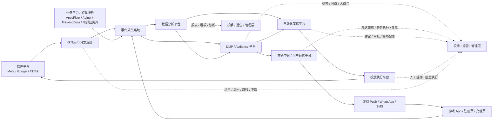
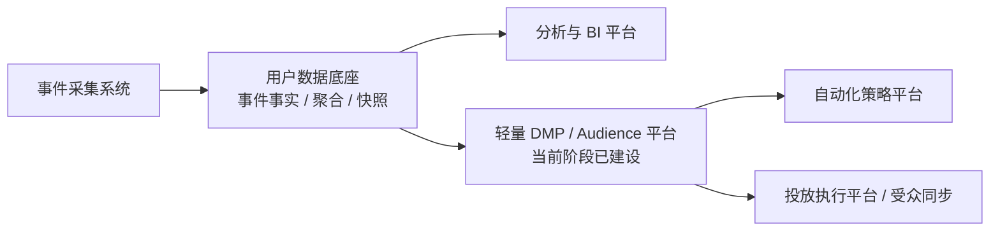
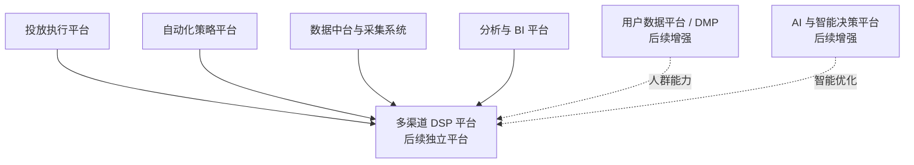

# 广告投放与程序化广告平台整体架构方案

> **适用公司**：AZSL / 艾泽 / AITRI  
> **业务场景**：广告投放执行、BI 分析、自动化投放、程序化平台、AI 投放能力建设  
> **当前重点**：在已具备落地页、数据、DMP 和营销触达骨架的基础上，继续补齐自动化策略、多渠道能力与平台化治理  
> **文档定位**：作为广告投放和程序化广告平台整体架构、当前阶段定位与后续演进顺序的参考方案

---

## 一、文档定位

这份文档不是数据分析平台专项设计，也不是 AI 专项设计，而是平台总纲文档，主要回答以下问题：

- 广告投放和程序化广告平台整体上应该拆成哪些一级系统
- 这些系统的职责边界如何定义
- 哪些能力属于数据平台，哪些能力属于执行、策略、素材、AI、协作系统
- 当前阶段应该先建设哪些系统，后续再补哪些系统

这份文档与其他专项文档的关系如下：

- `ad-platform-overall-architecture.md`
  - 负责平台总览、系统边界、建设顺序
- `ad-data-analytics-technical-plan.md`
  - 负责数据采集、建模、存储、指标、BI、调度、异常监控
- `API-uevent.md`
  - 负责面向业务方、游戏侧、落地页侧的统一事件上报接口协议
- `ad-dmp-technical-plan.md`
  - 负责当前已落地的轻量 DMP、标签、分群、人群包、Meta 同步与效果回流
- `game-marketing-platform-technical-plan.md`
  - 负责当前已落地的游戏营销中台、用户阶段触达、Push / WhatsApp / SMS 触达、效果回流与策略复盘
- `ai-efficiency-technical-plan.md`
  - 负责内部 AI 效能、知识库、协作助手、AI 员工相关能力
- `ai-full-process-automation-technical-plan.md`
  - 负责从想法到上线的 AI 全流程自动化

---

## 二、总体判断

对 AZSL 当前阶段，更合适的不是一次性建设一个“大一统广告平台”，而是在已经有落地页、采集、分析、DMP 和营销触达骨架的基础上，继续补齐自动化策略、多渠道扩展和平台治理能力。

当前并不是从 0 开始，已经具备以下基础：

- 已有自建事件采集系统，对外通过统一采集接口接收业务 / 游戏事件
- 已有多款游戏的广告落地页点击、安装注册、游戏内充值付费等行为数据
- 已有广告投放管理和 BI 系统，可为投手提供基础投放工具、投放日报和小时报分析
- 已有广告落地页系统，已覆盖页面模板、配置服务、事件中转、跳转服务和与 `uevent` 的接入适配

因此当前阶段更适合做的是 **在既有系统基础上统一边界、补平台短板、增强联动能力**，而不是完全推倒重做。

这套骨架的核心逻辑是：

1. 先把 **落地页、采集、分析、执行** 打通
2. 再把 **DMP 和营销触达闭环** 做成可用产品
3. 再重点补 **自动化策略、素材与 AI 建议能力**
4. 最后再往 **多渠道 DSP 和算法护城河** 演进

平台拆分时建议遵循以下原则：

- **按业务域划分**：执行、分析、自动化、素材、AI、协作分别归属不同系统
- **按变化节奏划分**：高频变化的策略层与相对稳定的数据底座分开
- **按风险边界划分**：高风险执行动作与分析、建议、审批能力分开
- **按复用能力划分**：权限、租户、日志、网关、任务调度等沉淀为平台公共能力
- **按阶段目标划分**：先支撑 Meta 提效，再扩展多渠道，再进入算法优化

这样组织的好处是：

- 不会把 BI、执行、自动化和 AI 全塞进一个大后台
- 后续做多渠道 DSP 时更容易扩展
- 更适合当前 10 到 15 人产研团队分阶段建设
- 更符合“先半自动、再自动化、最后算法化”的路线

### 2.1 当前已具备能力的定位

结合现状，当前平台骨架可以理解为：

- **事件采集底座已存在**
  - 已有统一事件采集接口和接入服务，后续继续完善标准化、回放和补数能力
- **分析与 BI 能力已有基础版本**
  - 已能支撑投放日报、小时报和基础投放分析
- **投放管理能力已有基础版本**
  - 已能服务投手日常投放操作
- **落地页与分发系统主链路已落地**
  - 当前已具备落地页前端、配置服务、事件中转、跳转服务和基础归因透传能力，后续重点是做模板标准化、短链路由、版本治理和多地域分发
- **DMP 已完成 MVP 和可用版落地**
  - 当前已形成轻量 DMP 应用层，支持标签、分群、人群包、Meta 同步和基础效果回流，正在向标准版迭代
- **营销中台已完成轻量 MVP 主链路**
  - 当前已具备策略配置、规则触发、消息任务、发送网关和基础回流能力，正在补齐真实渠道适配、治理和实验校验

因此这份总纲更适合定义“现有能力放在哪一层、后续如何演进”，而不是把所有系统都当作待新建系统。

---

## 三、平台总体架构

### 3.1 平台总览

从整体上看，平台可以理解为 5 层：

- **入口层**
  - 投手 / 运营 / 管理层
  - 设计 / 素材团队
  - 客户 / 外部协作
  - 内部系统 / 第三方系统
- **一级业务系统层**
  - 客户与权限系统
  - 落地页与分发系统
  - 投放执行平台
  - 数据中台与采集系统
  - 分析与 BI 平台
  - DMP / Audience 平台
  - 营销中台 / 用户运营平台
  - 自动化策略平台
  - 素材与创意平台
  - AI 与智能决策平台
  - 协作与流程平台
- **平台公共底座层**
  - API Gateway
  - 统一鉴权 / 多租户 / RBAC
  - 任务调度 / 消息队列
  - 日志 / 审计 / 监控告警
  - 配置中心 / 指标中心 / 元数据
- **外部依赖层**
  - Meta / Google / TikTok / 其他媒体
  - AppsFlyer / Adjust / ThinkingData / 业务系统
  - 游戏 Push / WhatsApp / SMS Provider
  - Lark / Telegram / 邮件 / Webhook
  - 模型服务 / 向量检索 / 对象存储
- **演进能力层**
  - 多渠道 DSP
  - 算法优化系统

### 3.2 平台总览图（Mermaid）

```mermaid
flowchart TB
    subgraph I["入口层"]
        I1["投手 / 运营 / 管理层"]
        I2["设计 / 素材团队"]
        I3["客户 / 外部协作"]
        I4["内部系统 / 第三方系统"]
    end

    subgraph A["一级业务系统"]
        A1["客户与权限系统"]
        A2["落地页与分发系统"]
        A3["投放执行平台"]
        A4["数据中台与采集系统"]
        A5["分析与 BI 平台"]
        A6["DMP / Audience 平台"]
        A7["营销中台 / 用户运营平台"]
        A8["自动化策略平台"]
        A9["素材与创意平台"]
        A10["AI 与智能决策平台"]
        A11["协作与流程平台"]
    end

    subgraph P["平台公共底座"]
        P1["API Gateway"]
        P2["统一鉴权 / 多租户 / RBAC"]
        P3["任务调度 / 消息队列"]
        P4["日志 / 审计 / 监控告警"]
        P5["配置中心 / 指标中心 / 元数据"]
    end

    subgraph E["外部依赖"]
        E1["Meta / Google / TikTok / 其他媒体"]
        E2["AppsFlyer / Adjust / ThinkingData / 业务系统"]
        E3["游戏 Push / WhatsApp / SMS Provider"]
        E4["Lark / Telegram / 邮件 / Webhook"]
        E5["模型服务 / 向量检索 / 对象存储"]
    end

    I1 --> A3
    I1 --> A5
    I1 --> A6
    I1 --> A7
    I1 --> A8
    I2 --> A8
    I3 --> A11
    I4 --> P1

    A1 --> P2
    A2 --> P1
    A3 --> P1
    A4 --> P3
    A5 --> P5
    A6 --> P3
    A7 --> P3
    A8 --> P3
    A9 --> P5
    A10 --> P1
    A11 --> P1

    A2 --> E5
    A3 --> E1
    A4 --> E1
    A4 --> E2
    A6 --> E1
    A7 --> E3
    A11 --> E4
    A10 --> E5
    A4 --> E5
```

### 3.3 当前系统映射

基于当前现状，建议先把已有能力映射到总纲架构中：

| 当前已有能力 | 在总纲中的归属 | 当前定位 |
|-----|------|------|
| 自建事件采集系统 / `API-uevent.md` 接入协议 | **数据中台与采集系统** | 已有基础底座，对外通过 `API-uevent.md` 提供统一事件上报协议，对内继续补事件标准化、归因质量、回放和补数能力 |
| 广告投放管理系统 | **投放执行平台** | 已有基础版本，后续补批量化、模板化、审计和自动化联动 |
| BI 系统 / 日报 / 小时报 | **分析与 BI 平台** | 已有基础版本，后续补统一指标、诊断、复盘，并增强与 DMP、营销中台、自动化策略联动 |
| 自建广告落地页 | **落地页与分发系统** | 主链路已实现，已具备页面模板、配置服务、事件中转、跳转服务和 `uevent` 对接能力，后续继续做标准化治理与多地域分发 |
| 轻量 DMP / Audience 能力 | **DMP / Audience 平台** | MVP 和可用版已完成，已支持标签、分群、人群包、Meta 同步和基础复盘，当前进入标准版迭代 |
| 游戏营销中台 / 用户运营能力 | **营销中台 / 用户运营平台** | 轻量 MVP 主链路已完成，已具备策略配置、规则触发、消息任务和基础回流，当前继续补真实渠道适配与治理能力 |

---

## 四、核心业务闭环

### 4.1 核心闭环定义

平台最重要的不是系统列表本身，而是能不能形成一条稳定闭环：

当前建议明确两条核心闭环：

1. **投放闭环**：媒体平台 -> 落地页与分发系统 -> 事件采集系统 -> 数据分析平台 / DMP -> 自动化策略平台 / 投放执行平台 -> 再回流媒体平台
2. **用户运营闭环**：DMP -> 营销中台 -> 游戏 Push / WhatsApp / SMS -> 游戏 App / 页面 -> 事件采集系统 -> DMP / BI

这条链里：

- **落地页与分发系统**：负责承接广告点击、落地页访问、跳转、下载与前链路事件
- **事件采集系统**：负责接收业务 / 游戏 / 落地页事件上报，完成鉴权、校验、落库和回放
- **数据分析平台**：负责统一口径、建模、看板、诊断和策略输入
- **DMP / Audience 平台**：负责标签、分群、人群包、Meta 同步和效果回流
- **营销中台 / 用户运营平台**：负责面向存量用户的触达策略、消息任务、渠道触达、页面联动和转化回流
- **自动化策略平台**：负责根据数据和规则做判断，决定是否触发动作
- **投放执行平台**：负责把动作真正执行到媒体平台
- **媒体平台**：产生新的投放结果，再回流到事件系统和分析平台

也就是说：

- 落地页与分发系统是“前链路触达层”
- 投放执行平台是“执行面”
- 自动化策略平台是“投放控制面”
- 营销中台是“用户运营执行面”
- 分析平台是“分析与判断依据层”
- 事件采集系统是“数据入口层”
- DMP 是“用户资产运营层”

### 4.2 核心闭环图（Mermaid）

### 4.3 这 7 类系统的边界总结

| 系统 | 核心问题 | 主要输出 |
|-----|---------|---------|
| **落地页与分发系统** | 广告点击后用户先进入哪里 | 落地页访问、跳转、下载、前链路事件 |
| **事件采集系统** | 数据怎么可靠进来 | 统一接入协议、原始数据、幂等去重、回放能力 |
| **数据分析平台** | 数据怎么变成可信资产 | 指标、明细、报表、诊断结果 |
| **DMP / Audience 平台** | 数据怎么变成人群资产 | 标签、分群、人群包、受众同步、包级回流 |
| **营销中台 / 用户运营平台** | 如何面向存量用户做触达 | 触达策略、消息任务、渠道执行、页面联动、回流复盘 |
| **自动化策略平台** | 应不应该做投放动作 | 建议、规则命中、自动化指令 |
| **投放执行平台** | 怎么把动作做出去 | 创建、修改、暂停、预算/出价执行结果 |

---

## 五、一级系统规划

### 5.1 一级系统职责说明

| 一级系统 | 核心职责 | 当前阶段优先级 |
|-----|------|------|
| **客户与权限系统** | 租户、客户、项目、成员、角色、权限、审计 | **高** |
| **落地页与分发系统** | 自建落地页、短链、跳转、下载分发、前链路事件采集 | **高，主链路已实现，当前做标准化增强** |
| **投放执行平台** | 广告账户、Campaign、Ad Set、Ad、预算、批量操作、发布执行 | **最高，已有基础** |
| **数据中台与采集系统** | 媒体侧数据、业务侧数据、文件导入、清洗、映射、统一指标口径 | **最高，已有基础** |
| **分析与 BI 平台** | 看板、报表、诊断、复盘、管理分析 | **最高，已有基础** |
| **DMP / Audience 平台** | 标签、分群、人群包、Meta 同步、效果回流 | **高，MVP / 可用版已完成，标准版迭代中** |
| **营销中台 / 用户运营平台** | 用户阶段识别、触达策略、消息任务、渠道触达、页面联动、效果复盘 | **高，轻量 MVP 主链路已完成，当前补治理与渠道适配** |
| **自动化策略平台** | 规则引擎、异常监控、自动调价、自动预算分配、策略执行 | **高** |
| **素材与创意平台** | 素材库、标签、版本、测试、效果分析 | **中高** |
| **AI 与智能决策平台** | AI 助手、预测、异常解释、优化建议、素材理解 | **中高，先建议型** |
| **协作与流程平台** | Lark / Telegram 摘要、审批、任务、工单、项目沉淀 | **高** |

### 5.2 一级系统之间的关键关系

- **投放执行平台** 和 **自动化策略平台**
  - 执行平台负责把动作做出去
  - 策略平台负责判断是否做动作
- **落地页与分发系统** 和 **数据中台与采集系统**
  - 前者负责广告点击后的承接、跳转、下载和前链路事件
  - 后者负责统一接入落地页、媒体侧、业务侧和归因侧数据
- **数据中台与采集系统** 和 **分析与 BI 平台**
  - 前者负责数据接入、标准化和统一口径
  - 后者负责看板、报表、诊断和业务消费
- **数据中台与采集系统** 和 **DMP / Audience 平台**
  - 前者负责可靠接入和统一数据底座
  - 后者负责标签、分群、人群包和受众同步
- **DMP / Audience 平台** 和 **营销中台 / 用户运营平台**
  - 前者负责产出状态、标签、分群和触达辅助结果
  - 后者负责消费这些结果，决定渠道、频控、页面和执行节奏
- **素材与创意平台**
  - 既给分析平台提供素材维度，也给策略平台和 AI 平台提供优化输入
- **协作与流程平台**
  - 负责承接 Lark / Telegram / 审批 / 项目沉淀，不承载投放核心交易逻辑

---

## 六、关键专题的归属

### 6.1 归因分析属于哪里

归因分析主归属于 **数据分析平台**，但完整链路会跨多个系统：

- **采集系统**
  - 接 AppsFlyer / Adjust / ThinkingData / 业务侧数据
- **数据分析平台**
  - 做归因口径统一、归因报表、ROI / ROAS / 回收分析
- **自动化策略平台**
  - 消费归因结果，做预算建议、调价建议、异常判断
- **投放执行平台**
  - 执行预算、出价、停启等动作

一句话说，**归因数据从采集进来，归因分析在分析平台，归因结果被策略平台消费，最终动作由执行平台完成。**

### 6.2 用户数据平台 / DMP 应该放在哪里

“用户数据平台”在广告投放语境里通常有两种不同含义，需要区分：

1. **用户行为 / 转化数据底座**
   - 例如注册、付费、留存、LTV、事件埋点、归因结果、用户生命周期
   - 应长期放在 **数据中台与采集系统 + 数据分析平台** 内部，作为稳定数据底座
2. **DMP / Audience 平台**
   - 例如标签体系、人群分群、受众包、再营销人群、媒体同步
   - 当前阶段已落成轻量独立应用层，但底层仍依赖事件采集系统和分析底座

### 6.3 用户数据平台的当前定位与后续演进

### 6.4 用户数据平台的边界建议

| 阶段 | 更适合的放置位置 | 主要能力 |
|-----|---------------|---------|
| **当前阶段** | 轻量独立 DMP 应用层 + 数据中台底座 | 标签、用户分层、人群包、Meta 同步、基础复盘 |
| **中期阶段** | DMP + 营销中台 + 自动化策略平台联动 | 价值分群、策略输入、包自动更新、更多渠道受众联动 |
| **后续阶段** | 更完整的独立用户数据平台 / DMP | 多渠道受众管理、相似人群、再营销、与 DSP 深度联动 |

### 6.5 DSP 应该放在哪里

DSP 不适合简单归到当前某一个一级系统里，更合理的理解是：

- **当前阶段**：DSP 先作为一组能力集合存在，由多个基础系统共同支撑
- **后续阶段**：当多渠道投放成为核心目标时，DSP 再独立成一级平台

原因是 DSP 天然横跨以下能力：

- 多渠道投放执行
- 预算与出价控制
- 分发策略与自动优化
- 跨渠道数据回流与效果归因
- 人群能力与后续 DMP 联动

因此如果现在直接把 DSP 塞进“投放执行平台”或“自动化策略平台”，后续边界会越来越乱。

### 6.6 DSP 与现有系统的关系

在当前这份平台规划里，DSP 更适合定义为：

> 在投放执行平台、自动化策略平台、数据中台与分析平台基础上，向上演进出来的多渠道分发与优化平台。

也就是说：

- **投放执行平台**：是 DSP 的执行底座之一
- **自动化策略平台**：是 DSP 的策略控制核心之一
- **数据中台与采集系统**：是 DSP 的数据反馈底座
- **分析与 BI 平台**：是 DSP 的观察与诊断层
- **用户数据平台 / DMP**：是 DSP 后续增强项，用于人群和受众能力

### 6.7 DSP 的演进关系图（Mermaid）

### 6.8 DSP 的当前定位建议

| 阶段 | 更适合的定位 | 说明 |
|-----|-------------|------|
| **当前阶段** | 多个基础系统共同支撑的能力集合 | 先做 Meta 提效，不急着单独建重型 DSP |
| **中期阶段** | 多渠道分发与策略控制平台 | 开始统一 Google、TikTok 等多渠道能力 |
| **后续阶段** | 独立一级 DSP 平台 | 与 DMP、AI、算法系统深度联动，形成平台化能力 |

---

## 七、二级模块清单

### 7.1 客户与权限系统

- 租户管理
- 客户管理
- 项目 / 游戏管理
- 成员与组织架构
- 角色权限与数据范围控制
- 账户授权关系
- 审计日志

### 7.2 投放执行平台

- 广告账户管理
- Campaign / Ad Set / Ad 管理
- 批量建计划与复制
- 预算与出价调整
- 投放模板管理
- 发布记录与回滚记录
- 执行任务中心

### 7.3 落地页与分发系统

- 自建广告落地页管理
- 短链与路由规则
- 跳转与下载分发
- 前链路参数透传
- 落地页访问事件采集
- 下载与安装前事件追踪
- 多地域与多包版本分发

### 7.4 数据中台与采集系统

- 媒体平台数据接入
- 业务侧转化数据接入
- 统一事件采集接口 `API-uevent.md`
- 事件接收、签名校验、幂等去重、原始落库
- 文件导入与半自动补录
- 币种与时区统一
- 账户 / 素材 / 国家 / 项目映射
- 指标口径中心
- 原始数据归档与回放
- 对外统一事件协议 `API-uevent.md`

### 7.5 分析与 BI 平台

- 管理驾驶舱
- 账户分析看板
- Campaign / Ad Set / Ad 分析
- 素材分析面板
- 国家与时段分析
- ROI / ROAS / 回收分析
- 日报 / 周报 / 月报
- 异常诊断与复盘中心

### 7.6 DMP / Audience 平台

- 标签中心
- 分群引擎
- 人群包管理
- Audience 导出与版本管理
- Meta 受众同步
- 包级效果回流与复盘
- 标签规则与任务调度

### 7.7 营销中台 / 用户运营平台

- 用户阶段识别
- 策略配置平台
- 模板中心
- 消息任务中心
- 渠道路由与发送网关
- 实验与校验中心
- 送达 / 点击 / 转化回流
- 频控、退订、失败重试治理

### 7.8 自动化策略平台

- 规则引擎
- 花费异常监控
- 转化异常监控
- 素材衰减识别
- 自动停启策略
- 自动调价策略
- 自动预算分配
- 策略审批与执行日志

### 7.9 素材与创意平台

- 素材库
- 素材标签与分类
- 素材版本管理
- 素材测试计划
- 素材效果归因
- 创意评分与洞察
- 素材复用推荐

### 7.10 AI 与智能决策平台

- AI 投放助手
- AI 数据问答
- 异常原因解释
- 优化建议生成
- 文案与素材辅助分析
- 效果预测
- 预算优化建议
- 策略模拟与评估

### 7.11 协作与流程平台

- Lark 协作沉淀
- Telegram 外部沟通摘要
- 需求 / 工单流转
- 审批流
- 项目进度沉淀
- 会议纪要与待办生成
- 复盘归档

### 7.12 平台公共底座

- API Gateway
- SSO / RBAC / 多租户
- 任务调度与消息队列
- 配置中心
- 指标中心与元数据中心
- 日志、监控、告警
- 成本统计
- OpenAPI / SDK

---

## 八、当前阶段更适合的建设顺序

结合当前“Meta 优先、落地页/采集/BI/DMP/营销中台主链路已落地、数据打通仍有难度、团队规模有限、要继续验证自动化价值”的现实，建议按以下顺序推进：

1. **第一批已基本具备的核心骨架**
   - 落地页与分发系统（已具备主链路）
   - 在现有投放执行平台基础上继续增强
   - 在现有事件采集系统基础上完善数据中台与采集系统
   - 在现有 BI 系统基础上继续增强分析与 BI 平台
   - 轻量 DMP / Audience 平台
   - 营销中台 / 用户运营平台轻量 MVP
2. **第二批当前应重点补齐**
   - 自动化策略平台
   - 客户与权限系统的最小版本
   - 落地页与分发系统标准化治理
   - 协作与流程平台
   - 素材与创意平台
3. **第三批再重点投入**
   - AI 与智能决策平台
   - 更完整的平台公共底座
   - 多渠道 DSP 能力

### 8.1 当前阶段的最小可用组合

当前阶段更接近“已有 6 套核心骨架 + 2 到 3 套待补平台”的状态：

- **已具备主链路的系统**
  - 落地页与分发系统（已具备落地页前端、配置服务、事件中转、跳转服务）
  - 投放执行平台（基于现有系统增强）
  - 数据中台与采集系统（基于现有事件采集系统增强）
  - 分析与 BI 平台（基于现有 BI 系统增强）
  - 轻量 DMP / Audience 平台
  - 营销中台 / 用户运营平台（轻量 MVP）
- **当前优先补齐的系统**
  - 自动化策略平台（规则优先，算法后置）
  - 客户与权限系统（轻量版）
  - 落地页与分发系统标准化治理

也就是说，当前阶段不建议再按“从 0 开始把所有系统一起启动”的思路推进，而应把已落地骨架继续打透，再补自动化、多渠道和治理能力。

---

## 九、文档边界建议

为了避免不同文档范围相互污染，建议后续按下面边界维护：

- `ad-platform-overall-architecture.md`
  - 负责平台总览
  - 负责一级系统、二级模块、系统边界、建设顺序
- `ad-data-analytics-technical-plan.md`
  - 负责数据采集、建模、存储、指标、BI、调度、异常监控
- `API-uevent.md`
  - 负责业务方、游戏侧、落地页侧统一事件上报协议
- `ad-dmp-technical-plan.md`
  - 负责轻量 DMP、标签、分群、人群包、Meta 同步与效果回流
- `game-marketing-platform-technical-plan.md`
  - 负责游戏营销中台、用户阶段触达、渠道执行、页面联动与回流复盘
- `ai-efficiency-technical-plan.md`
  - 负责内部 AI 效能、知识库、协作助手、AI 员工相关能力
- `ai-full-process-automation-technical-plan.md`
  - 负责从想法到上线的 AI 全流程自动化

这样拆分后：

- 平台总纲更清晰
- 数据专项不会被平台范围带偏
- AI 文档也不会和广告平台文档交叉重复