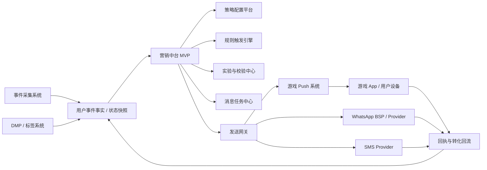
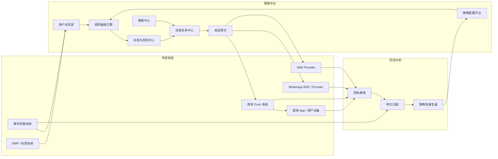
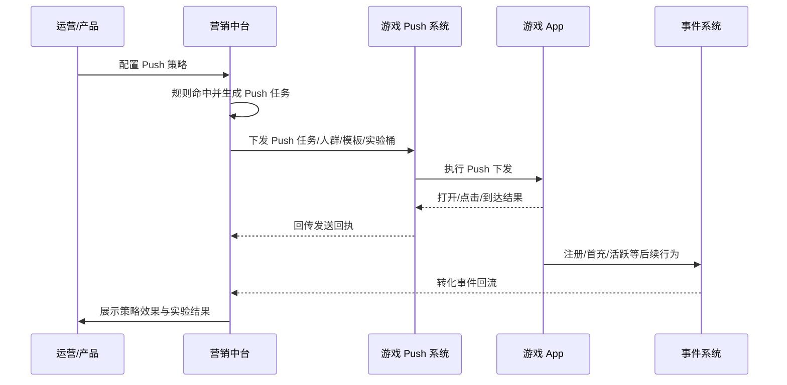

# 游戏营销中台 MVP 技术方案

> **适用公司**：AZSL / 艾泽 / AITRI
> **文档定位**：面向游戏用户分阶段触达的轻量营销中台 MVP 方案
> **适用阶段**：当前实现聚焦游戏 Push 策略平台、App Push、WhatsApp 和短信链路；现有演示与策略模板以印尼场景为主，Email 暂未纳入当前实现重点
> **相关文档**：用户标签与分群方案可单独补充专题文档，本文档聚焦用户触达、消息发送与效果回流
> **需求参考**：当前技术方案以《营销中台》需求文档作为业务参考，方向和价值目标需要保持一致

---

## 一、背景、现状与问题

当前业务已具备事件采集、用户行为沉淀、标签、分群和人群包能力，但仍缺少统一的营销触达平台，把用户阶段状态转成可执行动作和可复盘结果。

这里默认的前提是：

- `API-uevent.md` 是面向业务方、游戏侧、落地页侧的统一事件上报协议
- 营销中台不直接对外承接业务事件上报，而是消费事件采集系统与 DMP 已经沉淀好的结果

当前核心问题是：

- 缺少统一的用户阶段判断和触达规则中心
- 不同渠道触达逻辑容易分散在多个系统或脚本里
- 发送结果、打开、点击、注册、首充之间缺少统一回流链路
- 频控、退订、失败重试、幂等等基础治理能力不足
- 当前阶段不适合直接建设重型 Journey 编排平台或完整 CRM / CDP

因此，当前项目落地为轻量营销中台 MVP 更符合实际阶段。

从需求侧看，当前阶段需要优先对齐的价值目标主要有 4 个：

- 提升首充转化率，把“安装 / 注册 / 首充”之间的关键断点转成可配置触达链路
- 提升流失召回率，把沉默用户召回从人工操作转成策略驱动和可复盘执行
- 统一用户分阶段运营，把不同阶段用户对应的渠道、内容、页面和频控沉淀成规则资产
- 建立可校验闭环，让每条策略都能看到送达、点击、注册、首充、回流等后链路结果

---

## 二、当前结论

当前项目已经落成的方向，是一个 **基于现有事件系统、DMP 和游戏 Push 系统的轻量营销中台 MVP**。

当前实现与需求文档的主要一致性体现在：

- 以“分阶段用户运营”而不是“大而全 CRM”作为当前重点
- 先围绕“首充转化”和“流失召回”两类高价值场景沉淀策略能力
- 先落地可执行、可联动、可校验的轻量工作台，而不是复杂编排平台
- 让策略、渠道、页面和回流形成基础闭环，并可在工作台复盘

当前主链路已经收敛为：

1. 统一用户阶段状态与本地画像快照
2. 基于策略、规则和发送窗口生成消息任务
3. 通过工作台触发引擎运行、任务分发和结果复盘
4. 在 `App Push` 侧已补到“mock + 可选第三方 Push 基础调用”，继续逐步补齐真实渠道适配、回执映射和实验校验

---

## 三、方案边界

### 3.1 本方案包含

- 游戏用户分阶段状态定义
- Push 策略配置平台
- 规则触发与任务生成链路
- 与游戏 Push 系统的接口交互
- Push 策略生效校验
- 轻量实验分流与效果校验机制
- App Push / WhatsApp / SMS 渠道接入边界说明
- 模板中心、消息任务中心、发送网关
- 发送回执、转化回流和基础复盘
- MVP 实施路线、资源、成本和风险

### 3.2 本方案不包含

- 完整 CRM 平台
- 重型营销自动化编排平台
- 复杂实时推荐和智能决策
- 全域用户身份图谱
- 大规模实验平台
- 黑盒自动推荐和最佳发送时间优化

---

## 四、方案设计

### 4.1 系统定位

营销中台当前作为“事件系统 + DMP”之上的触达执行层，负责把用户阶段状态转成可执行的 App Push、WhatsApp、SMS 任务，并把结果回流给分析和策略层。

当前代码里，`App Push` 已支持 `mock push` 和可选第三方 Push HTTP 调用；长期边界仍是营销中台不直接管理终端推送通道，而是通过统一发送网关去适配外部执行方。



### 4.2 一级模块

- **策略配置平台**：管理策略、模板、发送窗口、频控、渠道路由和实验配置
- **用户状态层**：消费事件和标签结果，生成用户阶段状态
- **规则触发层**：按用户状态、时间窗口、渠道条件生成消息任务
- **实验与校验中心**：管理实验分流、效果归因和策略生效校验
- **消息任务中心**：管理待发送任务、重试和任务状态
- **发送网关层**：对接游戏 Push 系统、WhatsApp、SMS 等渠道
- **回流复盘层**：记录送达、打开、点击、注册、首充等结果

### 4.3 整体系统交互与边界

整体可以理解为四层：外部输入层、营销中台层、回流分析层、运营使用层。

当前边界如下：

- **事件系统负责**
  - 通过 `API-uevent.md` 对外接收业务方 / 游戏侧 / 落地页侧事件，完成鉴权、原始落库、标准事件输出
- **DMP / 标签系统负责**
  - 人群标签、阶段标签、分群结果输出
- **营销中台负责**
  - 策略配置、触发决策、任务编排、实验分流、效果校验、策略复盘
- **游戏 Push 系统负责**
  - 设备 Token 管理、Push 通道管理、客户端下发、Push 回执回传
- **WhatsApp / SMS 服务商负责**
  - 外部消息发送及回执返回

当前整体交互可概括为：



### 4.4 用户阶段与渠道边界

营销中台先回答两个问题：用户在哪个阶段，这个阶段哪些渠道可用。

当前 MVP 的核心能力可概括为 5 类：

- 用户阶段识别：识别点击未安装、安装未注册、注册未首充、沉默用户等状态
- 策略配置与执行：配置触发条件、模板、发送窗口、频控和渠道路由
- 多渠道触达：支持 App Push、WhatsApp、SMS 的统一任务生成与发送管理
- 效果校验与实验：支持对照组、基础实验分流和策略生效复盘
- 转化回流与复盘：回收送达、打开、点击、注册、首充、回流等结果

当前按下面的方式理解：

| 用户阶段 | 典型定义 | 当前主渠道 |
|-----|------|------|
| `clicked_not_installed` | 有点击，无安装 | WhatsApp / SMS |
| `installed_not_registered` | 已安装，未注册 | App Push / WhatsApp |
| `registered_not_paid` | 已注册，未首充 | App Push / WhatsApp / SMS |
| `paid_first_time_pending_repeat` | 已首充，待复充 | App Push / WhatsApp |
| `dormant_7d` | 近 7 天未活跃 | App Push |

关键说明：

- 营销平台应优先以 `person_id` 作为统一触达主体，再按渠道能力判断是否还需要 `user_id`、手机号或其他标识
- 安装前通常缺少稳定的 App / 账号触达能力，因此当前更偏向 WhatsApp / SMS 等外部触达渠道
- 安装后当前更偏向 App Push，WhatsApp / SMS 作为补充或高价值提醒渠道
- 当前实现里，`App Push` 是否可发以 `push_reachable` 为准；`has_push_token` 会同步到本地画像，但主要用于补充画像和排查，不作为 S2S App Push 的硬门槛
- App Push 的实际发送当前走统一发送网关；代码里已支持 `mock push` 和可选第三方 Push HTTP 调用，后续仍可继续收敛到游戏 Push 系统或统一 provider
- Email 当前不作为前期重点渠道，主要原因是实际价值有限且风控限制较严

### 4.5 当前实现架构

当前实现采用 **状态快照 + 规则触发 + 任务执行** 的轻量架构。

当前这样实现的原因主要是：

- 更适合当前 0 到 1 验证阶段
- 更容易快速验证安装、注册、首充类转化
- 可直接复用现有事件系统、DMP、BI 和游戏 Push 系统
- 也便于后续继续补真实渠道和自动化调度

### 4.6 Push 策略配置平台

第一个核心要求，本质上就是要有一个 **让游戏 Push 按策略执行** 的配置平台。

按当前实现和文档口径，策略平台围绕以下配置能力展开：

- 策略基本信息
  - 策略名称、适用游戏 / `app_ids` 列表、启停状态、优先级、负责人
- 目标人群条件
  - 用户阶段、标签条件、国家、语言、渠道来源、注册时长、付费状态
- 触发条件
  - 事件触发、延迟触发、定时触发、冷启动触发
- Push 内容配置
  - 标题、正文、落地页、深链、素材、语言版本、WhatsApp 模板类型
- 页面跳转配置
  - 支持按策略、用户阶段、渠道绑定不同注册页、活动页、充值页或游戏内深链
- 发送约束
  - 发送窗口、用户级频控、策略冷却、渠道日频、去重窗口和抑制名单
- 渠道路由配置
  - 选择主渠道、兜底渠道顺序，以及失败后是否继续尝试下一跳
- 执行方式
  - 立即发送、按时间窗口发送、按任务实时组批发送
- 校验与实验
  - 是否开启实验、流量比例、观察窗口、成功指标和人工确认切换
- 渠道特有限制
  - WhatsApp 模板报备要求、会话窗口限制、短信签名或通道限制

当前实现口径：

- 配置统一放在 `PostgreSQL`
- 规则解释和任务生成由 `Go` 服务完成
- 支持“草稿 -> 审核 -> 生效 -> 下线”
- 当前运营工作台以“列表 + 详情 + 右侧配置联动”为主，不做复杂可视化编排
- 支持在当前策略基础上“复制为新策略”，以草稿方式快速派生相似策略
- 支持单策略“重跑当前策略”，并返回评估漏斗、无渠道细分和限流细分结果

### 4.6.1 个性化内容与模板系统

这部分在当前文档里作为营销中台的基础能力说明。

当前不展开复杂的“千人千面推荐”，主要保留 **模板化内容 + 参数化渲染 + 分层个性化** 的能力边界。

当前模板能力主要按以下维度理解：

- **多渠道模板**
  - 区分 App Push、WhatsApp、SMS 的模板结构、长度限制和变量规则
- **多语言模板**
  - 同一策略支持不同国家和语言版本，如英语、印地语等
- **变量占位能力**
  - 支持昵称、游戏名、活动名、奖励金额、倒计时、落地页链接、深链参数等变量
- **分层个性化**
  - 按用户阶段、国家、语言、渠道、价值等级选择不同模板版本
- **模板版本管理**
  - 当前实现保留 `version` 字段，以及轻量的可用状态控制
  - 模板中心本身不引入内部审核流；如外部渠道存在报备或可用性要求，仅记录外部映射 / 外部状态，不额外增加运营审核环节
- **渠道适配校验**
  - 发送前检查文案长度、变量完整性、WhatsApp 模板报备要求、SMS 签名要求
- **按星期文案**
  - `weekday_enabled` 开启后，支持按周一到周日分别维护标题和正文
  - 未覆盖的日期自动回退到默认 `title / body`

当前个性化口径分 3 层：

1. **规则级个性化**
   - 不同用户阶段命中不同模板，如 `installed_not_registered` 和 `registered_not_paid` 用不同内容
2. **属性级个性化**
   - 按国家、语言、渠道、价值等级切换文案版本
3. **参数级个性化**
   - 在模板中动态填充活动名、奖励金额、用户昵称、页面参数等变量

当前优先围绕下面这几类变量组织模板：

- `user_name`
- `game_name`
- `activity_name`
- `reward_amount`
- `currency`
- `landing_page_url`
- `deep_link`
- `strategy_id`
- `experiment_bucket`

当前边界：

- 模板系统负责“内容结构、版本、变量渲染和渠道校验”
- DMP 负责提供用户分层、国家、语言、价值等级等个性化输入
- 营销中台负责根据策略选择模板并完成参数填充
- 游戏侧负责承接深链、活动页、注册页、充值页等页面内容联动

一句话说：当前阶段的个性化，主要靠“规则选模板 + 参数填变量 + 页面联动”实现。

### 4.6.2 模板中心 MVP 落地方案

考虑到业务 / 游戏侧未必会稳定提供可直接复用的 Push 模板，当前阶段把模板中心收敛为“营销平台自主管理内容母版，渠道侧只负责真实发送和必要适配”的模式。

当前落地原则：

- 模板中心是独立模块，不再把模板能力仅埋在策略表单的 `template_ids` 里
- 策略负责“选模板”，模板中心负责“管内容、版本、语言、渠道映射、provider 状态”
- `app_id` 作为一级隔离维度，支持全局模板和 App 专属模板并存
- 不做重型 Journey / 素材系统，先做可运营的轻量模板库

当前模板模型在原有 `template_id / channel / language_tag / title / body / variables / version` 基础上，补充下面这些核心字段：

- `app_id`
  - 空值表示全局模板；非空表示只服务指定游戏
- `scene_key`
  - 模板场景标识，例如 `install_register`、`first_pay`、`dormant_recall`
  - 让模板按运营场景沉淀，而不是被活动名堆满
- `description`
  - 说明模板适用场景、限制和注意事项
- `provider_template_code`
  - 记录 WhatsApp / SMS / 第三方 Push 等渠道要求的外部模板编码
- `provider_status`
  - 如有需要，仅记录外部渠道映射或外部可用性状态，例如 `not_required / pending / approved / rejected`
  - 该字段不代表营销平台内部模板审核流
- `tags`
  - 辅助运营筛选和复用，例如“召回”“活动”“新手”
- `weekday_enabled`
  - 控制是否启用“按星期文案”模式
  - 关闭时继续使用默认 `title / body`
- `weekday_contents`
  - 按 `monday ... sunday` 存储每天的标题和正文
  - 某一天未填写时自动回退到默认 `title / body`

当前页面能力收敛为一版 MVP：

- 模板列表
  - 支持按关键字、渠道、状态、`app_id` 筛选
- 模板编辑
  - 支持维护默认标题 / 正文，以及“按星期文案”开关和周一到周日的差异化内容
  - 支持维护变量、标签、场景、App 作用域，以及按需维护 provider 编码 / 外部可用性信息
- 模板预览
  - 允许输入示例变量 JSON，本地预览默认文案和指定星期的最终效果
- 模板复制
  - 用于从通用母版快速派生新语言、新 App 或新活动版本

当前策略与模板的关系保持兼容：

- 策略仍通过 `template_ids[channel]` 引用模板，避免一次性重构执行链路
- 策略页的模板下拉框会展示 `scene_key / app_id / language_tag / status`
- 后端保存策略时会校验模板是否存在，以及模板渠道是否与策略渠道一致
- 发送执行时由模板系统按发送当天的星期自动解析文案，策略本身无需维护 7 份模板

当前设计刻意保留的边界：

- 不在当前阶段引入模板审核流；模板中心保持轻量治理，重点解决内容组织、复用和外部映射问题
- 不在当前阶段实现模板历史版本回滚界面，但继续保留 `version` 字段
- 不在当前阶段实现自动变量渲染下发，预览只作为运营校稿能力
- 不在当前阶段引入模板组 / 模板解析引擎；后续如模板规模上来，再把策略从 `template_ids` 演进到 `scene_key + app_id + channel + language_tag` 解析模式

适用场景举例：

- 类似“首冲未复充召回”这类周内节奏型触达，不再要求运营复制 7 个模板
- 运营只需维护 1 条模板，打开 `weekday_enabled` 后分别填写周一到周日文案
- 普通活动模板继续按单份默认文案维护，不受该能力影响


这部分的核心是把职责边界说清楚：

- 营销中台负责“决定给谁发、什么时候发、发什么内容、带什么策略和实验信息”
- 游戏 Push 系统负责“真正发到设备，并回传送达 / 打开 / 点击等结果”

按当前实现和联调方向，交互模式收敛为“营销中台基于待发送任务实时组批，再调用 Push 执行方接单”。当前代码里，`App Push` 已支持两条执行路径：

- 配置真实第三方 Push 参数时，调用第三方 Push HTTP 接口
- 未配置时，回退到本地 `mock push` 批次记录

接口协议不必在方案里展开过细，当前主要关注下面几类能力：

- **批量下发接口**：接收批次、人群、模板参数、发送窗口、实验桶、`app_id`、落地页或深链参数
- **状态查询接口**：查询批次是否已接收、执行中、完成或部分失败
- **回执回调接口**：回传批次维度和用户维度的送达、打开、点击、失败原因
- **页面参数透传能力**：支持把 `strategy_id`、`experiment_bucket`、落地页或深链参数带到游戏侧页面

批量下发最小模型当前保留：`batch_id`、`strategy_id`、`app_id`、`template_id`、`send_window`、`experiment_bucket`、`landing_page_url / deep_link`、`user_list`。

当前补充说明：

- 任务当前按 `strategy_id + app_id + channel + template_id + experiment_bucket` 进行分组后再发送，避免不同游戏混批
- `marketing_message_task`、`marketing_send_log` 和最近发送批次当前都已固化 `app_id`
- 第三方 Push 当前已补到基础请求、签名、分片发送和手工结果查询接口，但 provider `taskNo` 还未在日常分发链路中完整沉淀

当前链路如下：



### 4.7.1 WhatsApp 与 SMS 的接口形态

除游戏 Push 外，`WhatsApp` 和 `SMS` 当前也按统一消息模型组织，再由渠道适配层转换成各自供应商接口。

当前方案不需要在文档里展开各家供应商字段差异，保持下面几个原则即可：

- 内部统一消息对象，至少包含 `channel`、`batch_id`、`strategy_id`、接收人信息、消息内容、模板参数、落地页或深链、发送窗口、实验桶
- `WhatsApp Adapter` 负责模板消息转换，`SMS Adapter` 负责短信请求转换
- 渠道回执统一落到 `marketing_send_log`
- 国家、语言、签名、模板审核和发送限制按 `country_code + channel` 做配置扩展

一句话说：营销中台内部不直接绑定具体厂商，而是先统一消息模型，再用适配层对接真实渠道。

### 4.8 如何校验 Push 策略是否生效

第三个核心要求不是“有没有发出去”，而是“策略是否真正生效”。

当前校验口径分成三层：

1. **执行层校验**
   - 是否按策略成功生成任务
   - 是否成功分批并写入发送记录
   - `App Push` 当前是否成功调用 mock 或第三方 Push 接口
2. **触达层校验**
   - 当前优先检查发送窗口、频控、去重、抑制或无可用渠道导致的大量过滤
   - 真实送达、打开、点击等细粒度回执仍依赖后续 provider / 游戏 Push 系统进一步打通
3. **业务层校验**
   - 是否提升安装、注册、首充、回流等目标转化
   - 相比未触达组或对照组是否有显著改善

当前核心校验指标：

- 策略命中人数
- 任务生成成功率
- Push 系统接单成功率
- 送达率
- 打开率
- 点击率
- 目标转化率
- 转化提升率
- 用户投诉 / 退订 / 关闭通知占比

当前工作台和复盘口径至少覆盖：

- 每条策略都自动生成一张效果看板
- 看板至少展示“命中 -> 下发 -> 送达 -> 打开 -> 点击 -> 转化”的漏斗
- 当前工作台至少应支持“评估 -> 命中 -> 发送窗口 -> 有无可用渠道 -> 新建 / 抑制 / 限流 / 去重”的执行摘要
- 当任务生成成功但 Push 系统未执行、或送达率异常下降时，自动告警

### 4.8.1 如何避免重复触达和用户骚扰

这部分应作为 MVP 的基础治理能力。

当前治理口径按 6 层控制理解：

1. **用户级总频控**
   - 限制单用户每天、每 3 天、每 7 天的总触达次数
   - 避免同一用户同时被多个策略反复命中
2. **策略级频控**
   - 同一策略对同一用户设置冷却时间，如 `24 小时` 内最多触达一次
   - 避免同一策略重复轰炸
3. **渠道级频控**
   - App Push、WhatsApp、SMS 分别设置单日上限和冷却窗口
   - SMS 和 WhatsApp 通常比 App Push 更严格
4. **跨渠道去重与优先级**
   - 同一时段命中多个策略或多个渠道时，只保留优先级最高的一条任务
   - 例如优先 `App Push`，其次 `WhatsApp`，最后 `SMS`
5. **发送窗口与负反馈抑制**
   - 只在策略配置的发送时段内发送；当前 `0 -> 0` 视为全天可发
   - 用户退订、投诉、关闭通知时，应自动降频或暂停
6. **转化后自动停发**
   - 用户一旦完成注册、首充或回流，应立即停止当前目标策略的后续任务
   - 避免用户已完成动作但系统仍继续催促

当前文档采用的最小规则如下：

- 单用户单日总触达不超过 `2` 次
- 同一策略 `24 小时` 内不重复触达同一用户
- `SMS / WhatsApp` 单用户单日最多 `1` 次
- 默认保留发送窗口；`0 -> 0` 视为全天发送
- 用户完成目标转化后，相关任务自动失效
- 用户命中退订、投诉、关闭通知后，进入抑制名单
- 单策略重跑时，会先取消该策略已有的 `pending` 任务，再重新生成新任务；其他历史状态不清理
- 如果启用了 Redis governor，取消 `pending` 时需要同步释放对应的预占额度，避免重跑后仍被旧频控占位阻塞

当前实现相关的存储职责如下：

- `Redis`
  - 存用户级、渠道级、策略级频控计数和冷却键
- `marketing_message_task`
  - 存任务幂等键、触发来源、优先级、失效时间
- `marketing_send_log`
  - 记录最近触达历史、失败原因和负反馈结果
- `marketing_user_profile`
  - 存退订状态、Push 可达状态、`has_push_token`、WhatsApp 可达状态、SMS 可达状态

一句话说：营销中台不是“命中了就发”，而是先过发送窗口、频控、去重、负反馈和转化停发规则，再决定要不要发。

### 4.9 轻量实验分流与效果校验

当前实验相关内容按 **轻量实验分流与效果校验** 理解，而不是独立实验平台。

当前文档保留的实验口径包括：

- 单策略双版本实验
  - 例如标题 A / 标题 B，文案 A / 文案 B
- 发送时间实验
  - 例如注册后 2 小时 vs 24 小时
- 渠道实验
  - 例如 Push only vs Push + WhatsApp
- 留出对照组
  - 用于判断策略是否真正带来增量

轻量实验分流的最小机制：

- 策略配置时可开启实验
- 设定实验桶比例，如 `45% / 45% / 10% 对照组`
- 任务生成时按用户稳定分桶
- 回流时自动按桶统计送达、打开、点击、注册、首充
- 达到观察窗口后自动产出实验结果

当前实验判定口径：

- 如果某版本触达更好但转化更差，不自动全量
- 只有同时满足最小样本量和目标指标提升阈值，才考虑切主版本
- 当前更接近“自动出结果 + 人工确认切换”
- 自动放量仍属于后续待补齐能力

### 4.10 核心链路

```text
事件系统 / DMP 标签结果
    -> 用户状态快照
    -> 策略配置读取
    -> 规则匹配
    -> 实验分流
    -> 生成消息任务
    -> 频控 / 去重 / 渠道检查
    -> 调用游戏 Push 系统 / WhatsApp BSP / SMS Provider
    -> 回执入库
    -> 注册 / 首充 / 活跃结果回流
    -> 规则复盘
```

### 4.11 当前已覆盖的核心触达场景

当前文档围绕 4 类高价值场景组织：

1. **点击后未安装提醒**
   - 目标：推动安装
   - 渠道：WhatsApp / SMS
2. **安装后未注册提醒**
   - 目标：推动注册
   - 渠道：App Push / WhatsApp
3. **注册后未首充提醒**
   - 目标：推动首充
   - 渠道：App Push / WhatsApp / SMS
4. **7 天未活跃召回**
   - 目标：推动回流
   - 渠道：App Push

#### 4.11.1 示例 1：首充转化策略

这个场景对应外部需求里提到的“首充转化策略”。

- 目标不是只做一条策略，而是按用户当前阶段拆成不同路径
- 路径 A：`installed_not_registered`
  - 当前主渠道：App Push
  - 内容方向：首充福利、注册后可领活动、关键激励信息
  - 点击后页面：注册页或注册引导页，页面上需要展示首充活动信息
- 路径 B：`registered_not_paid`
  - 当前渠道口径：WhatsApp / SMS 优先；已安装且可触达时也可补 App Push
  - 内容方向：充值活动、限时奖励、首充礼包、任务激励
  - 点击后页面：充值活动页、充值落地页或游戏内充值深链
- 触发条件：按不同路径分别配置，如注册后 `2 小时 / 24 小时` 未首充，或安装后一定时间仍未注册
- 策略动作：根据路径匹配不同文案、不同渠道和不同落地页
- 校验指标：送达率、打开率、点击率、首充转化率、转化提升率
- 实验方式：版本 A / B 文案，对照组留白，观察 `24 小时 / 72 小时` 转化表现

#### 4.11.2 示例 2：流失召回策略

这个场景对应外部需求里提到的“流失召回”。

- 目标人群：`dormant_7d`
- 触发条件：近 7 天无活跃事件，且满足发送窗口、频控和抑制规则
- 当前主渠道：App Push；高价值用户可补 WhatsApp 或 SMS
- 策略动作：发送回流奖励、限时活动、任务提醒或版本更新通知
- 校验指标：送达率、打开率、回流率、回流后 3 日活跃率、回流后付费率
- 实验方式：不同激励内容、不同发送时间、是否补发 WhatsApp 的分组实验

### 4.12 当前技术对接方式

当前实现复用现有事件系统和 DMP 结果，不直接绕过这两层去消费业务方底层库。

当前对接方式：

- **用户状态来源**
  - 当前以现有事件系统标准事件表或 DMP 标签结果为主
- **主交付方式**
  - 以 `DMP` 结果表 / 只读视图为主，不以文件交接作为日常主链路
  - 营销中台按 `snapshot_time / updated_at` 做增量读取
- **Push 下发方式**
  - 当前按统一批量 Push 接口模型设计
  - 营销中台基于待发送任务实时组批，再调用 mock 或外部 Push 执行方
- **当前交付对象**
  - 用户状态快照，如 `dmp_user_state_label`
  - 分群结果快照，如 `dmp_segment_result_snapshot`
  - 也可以单独提供营销平台专用宽表或视图，如 `marketing_user_target_snapshot`
- **任务触发方式**
  - `T+1` 日批 + 5 分钟或 1 小时增量刷新
- **配置交互方式**
  - 统一放 `PostgreSQL`
  - 包括策略、规则、模板、渠道配置、频控、退订策略、实验配置

当前实现补充说明：

- 当前项目里，`ClickHouse / DMP` 的作用是把用户状态和画像信息增量同步到营销中台本地库
- 管理端已支持手动触发 DMP 同步，并展示最近一次同步时间、同步行数、同步用户数和当前本地用户规模，方便联调排查
- `POST /api/v1/engine/run` 执行时不会实时调用 DMP 接口，而是直接读取本地 `marketing_user_profile`、`marketing_user_state_snapshot`、策略、规则和抑制名单生成触达任务
- 因此当前执行链路更准确地说是：`DMP / ClickHouse -> PostgreSQL 本地快照 -> Engine Run -> Message Task -> Dispatch`
- 这意味着引擎可以和 DMP 同步解耦运行：即使暂时未开启 DMP，也可以通过手工写入用户画像/状态或本地 seed 数据来验证策略链路
- 当前时区口径优先按外部产品配置接口返回的 `app_id -> timezone` 计算；只有产品级配置缺失时，才回退到用户画像中的 `timezone`
- 这意味着在当前业务前提下，DMP 不必强依赖逐用户维护 `timezone` 字段，产品级稳定时区即可支撑发送窗口和日频计算
- 当前 DMP 同步会把 `has_push_token` 一并落到本地画像，但 `App Push` 是否可发仍以 `push_reachable` 为准
- **回流方式**
  - 当前以基础发送日志和手工反馈回写为主
  - 第三方 Push 已补手工结果查询接口，但日常分发链路里的 provider 回执闭环仍待补齐
  - 用户后续注册 / 首充 / 活跃结果从事件系统回流

当前实现要点：

| 维度 | 当前实现 |
| --- | --- |
| 用户数据来源 | 本地 PostgreSQL 中的 `profile/state` 快照；可来自 DMP 同步、手工写入或 seed 数据 |
| 引擎运行时取数 | `engine/run` 直接读本地库，不实时调 DMP |
| 任务生成方式 | 管理员可手动触发全局 `POST /api/v1/engine/run`，也可在工作台按策略单独重跑 |
| 发送执行方式 | `dispatch/run` 手动执行；`App Push` 当前支持 `mock push` 或可选第三方 Push HTTP 调用，其它渠道仍以本地适配占位为主 |
| 数据准备方式 | 可通过 `seed-demo` 命令快速构造演示数据 |
| 当前目标 | 便于验证策略、路由、频控、fallback 和复盘链路 |

当前最小交付字段：

- `person_id`
- `person_id_type`
- `user_id`
- `app_id`
- `snapshot_time`
- `lifecycle_state`
- `value_level`
- `country_code`
- `language_tag`
- `has_phone`
- `has_push_token`
- `channel_reachability_hint`

当前实现补充说明：

- 营销平台当前已经转向以 `person_id` 作为核心触达主体，`user_id` 作为已注册场景下的补充标识
- 这样可以同时支持“未注册用户”和“已注册用户”进入同一套策略体系
- 策略判断、任务去重、频控、抑制和转化停发，当前默认都以 `person_id` 为主
- `person_id_type` 需要由 DMP 明确提供，用于标识该主体的来源类型，如设备、安装主体、账号主体等
- 对游戏内 Push 或账号体系强绑定的渠道，可以在任务执行阶段继续结合 `user_id` 判断是否可达

文件方式的定位：

- 可用于一次性补数、历史归档、人工运营活动导入或审计留痕
- 当前不作为营销中台日常策略触发的主交付方式

当前不采用的做法：

- 每个业务线自己写脚本直连第三方发送
- 营销中台直接接管游戏 Push SDK 和设备通道
- 直接在原始事件表上做触发判断和发送
- 让 `DMP` 以文件形式每天给营销中台手工导入用户列表
- 不做频控、去重、退订和失败重试

### 4.13 当前表结构与职责

当前表结构主要拆成下面几类表：

1. **用户与状态表**
   - `marketing_user_profile`
   - `marketing_user_state_snapshot`
2. **策略、规则与实验表**
   - `marketing_push_strategy`
   - `marketing_trigger_rule`
   - `marketing_experiment_plan`
   - `marketing_experiment_bucket_result`
   - `marketing_message_template`
3. **消息任务与发送表**
   - `marketing_message_task`
   - `marketing_send_log`
4. **回流与分析表**
   - `marketing_conversion_log`
   - `marketing_channel_feedback_daily`
   - `marketing_contact_suppression`

当前职责如下：

- `marketing_user_profile`
  - 存 `person_id / person_id_type / user_id`、手机号、WhatsApp 可达状态、Push 可达状态、语言、国家、时区、退订状态
- `marketing_user_state_snapshot`
  - 存当前阶段状态、最近关键行为时间、可触达渠道、最近发送时间
- `marketing_push_strategy`
  - 存策略范围、优先级、发送窗口、频控、审核状态、执行目标、默认落地页或深链，以及适用 `app_ids`
- `marketing_trigger_rule`
  - 存目标状态、触发延迟、渠道策略、频控规则、优先级、页面跳转规则
- `marketing_experiment_plan`
  - 存实验版本、流量比例、指标、观察窗口、自动切换阈值
- `marketing_experiment_bucket_result`
  - 存用户分桶结果、版本命中记录、实验归因信息
- `marketing_message_template`
  - 存渠道模板、多语言版本、变量定义、轻量可用状态、模板版本信息，以及页面参数模板
  - 模板变量当前已进入发送链路：任务生成时会按用户 / 策略 / 渠道上下文渲染标题、正文和跳转参数
- `marketing_message_task`
  - 存某个用户在某个时点命中的待发送任务、实验桶、`app_id` 快照、路由链路，以及当前本地记录的外部批次 / 消息标识
  - 当前已额外固化渲染后的 `title / body` 快照，避免个性化模板在后续组批时串内容
- `marketing_send_log`
  - 存实际发送结果、`app_id`、当前本地记录的批次 / 消息标识、基础发送状态和失败原因
  - Third Push 当前已支持 provider `taskNo` 落库，并可通过回查接口把结果回写到本地任务
- `marketing_conversion_log`
  - 存发送后发生的注册、首充、活跃等结果
- `marketing_channel_feedback_daily`
  - 当前已落地，按发送日期、策略、App、渠道沉淀 `targeted / pending / dispatched / delivered / opened / clicked / converted / failed / fallback_tasks`
  - 用于复盘看板、渠道告警和后续离线分析
- `marketing_experiment_bucket_result`
  - 当前已落地，按发送日期、策略、App、实验桶沉淀同一套漏斗指标
  - 用于实验桶效果对比、对照组分析和后续自动优化
- `marketing_contact_suppression`
  - 存退订、投诉、关闭通知、强静默用户和临时抑制名单

### 4.14 当前实现范围

当前实现主要覆盖 5 类能力：

- **状态识别**：点击未安装、安装未注册、注册未首充、7 天未活跃
- **策略能力**：Push 策略配置、审核生效、发送窗口、基础频控、主渠道与兜底路由
- **渠道发送**：`App Push` 当前支持 mock 和可选第三方 Push 基础调用；`WhatsApp / SMS` 仍以本地适配占位为主，Email 暂未纳入当前实现重点
- **页面联动**：至少支持“注册页”和“充值活动页”两类落地页或深链按策略切换
- **实验校验**：基础 A/B 分桶、对照组、送达和转化复盘

从当前实现看，下面这些能力已经是主链路的验收重点：

- 能稳定识别核心用户阶段
- 能通过策略平台自动生成并发送基础触达任务
- 能记录基础分发结果、失败原因和任务 / 批次维度的发送轨迹
- 能校验策略是否完成任务生成、实时组批和基础发送调用
- 能看到注册、首充、活跃等后链路结果
- 能输出基础 A/B 结果和对照组效果
- 规则、模板、发送记录和回流结果可以追溯

---

## 五、技术选型

### 5.1 当前技术栈

- **Go**
  - 营销中台后台服务、规则触发任务、实验分流、发送网关、管理 API
- **ClickHouse**
  - 用户事件、状态快照、营销分析和回流复盘
- **PostgreSQL**
  - 策略、规则、模板、实验配置、消息任务、发送日志、退订状态、审计
- **Redis**
  - 频控、幂等、去重、短期状态缓存、任务锁
- **Caddy**
  - 正式环境默认入口层，负责 HTTPS 反向代理和证书续期
- **对象存储**
  - 模板素材、归档日志、回执文件
- **Cron / Airflow**
  - 状态刷新、规则触发、补算、实验复盘和回流调度

### 5.2 为什么这样选

- `Go` 适合做规则匹配、任务调度和渠道发送服务
- `ClickHouse` 适合复用现有分析底座，做回流与复盘
- `PostgreSQL` 更便于管理策略、规则、实验、模板、任务和审计元数据
- `Redis` 适合做频控、防重和短时缓存

### 5.3 当前渠道接入边界

- **App Push**
  - 当前已作为主渠道口径
  - 适合安装后场景
  - 当前通过统一发送网关承接执行；代码里已支持 `mock push` 和可选第三方 Push HTTP 调用
- **WhatsApp**
  - 当前已纳入渠道边界
  - 适合安装前补触达和安装后关键动作提醒
  - 需要考虑模板审核、会话窗口和发送资质
- **SMS**
  - 当前已纳入渠道边界，但仍需严格控制触达人群和发送频次
- 更偏向高价值提醒和关键动作催化场景
  - 成本和合规要求更高，需要严格频控和退订
- **Email**
  - 暂未纳入当前实现重点

当前渠道接入保持两条原则：

- 营销中台内部保留统一消息模型和适配层，不直接绑死具体厂商
- 渠道开关、发送限制、模板语言、签名和回执策略按 `country_code + channel` 配置扩展

---

## 六、投入产出评估

### 6.1 人力投入

当前阶段估算：

- 产品经理：0.5 人月
- 后端研发：1 到 1.5 人月
- 数据研发：0.5 到 1 人月
- 前端研发：0.3 到 0.5 人月
- 测试 / 联调：0.5 人月

### 6.2 基础设施投入

- 应用机：当前先按 1 台主机评估，正式环境默认部署 `app + caddy + redis`
- PostgreSQL：1 套独立实例
- Redis：当前默认跟应用同机部署；后续如并发和容量继续上升，再拆成独立实例
- ClickHouse：继续复用现有集群
- 对象存储：用于模板素材和日志归档

### 6.3 第三方成本

- Push：成本相对低，主要是接入和维护成本
- WhatsApp：按会话或消息量计费，需重点关注模板审核和会话费用
- SMS：按条数计费，是主要成本变量，需结合目标国家资质、Sender ID 和本地合规要求评估
- 游戏 Push 系统对接：主要是一次性接口联调和回执打通成本

### 6.4 时间评估

- 第 1 阶段 MVP：2 到 3 周
- 第 2 阶段可用版：4 到 5 周
- 第 3 阶段标准版：6 到 8 周

### 6.5 直接收益

- 提升安装、注册、首充等关键转化动作的自动触达能力
- 降低人工运营重复提醒和人工拼表成本
- 提高不同渠道触达的统一管理和复盘效率
- 让游戏 Push 从“人工配置”走向“策略驱动和可校验”

### 6.6 间接收益

- 把用户阶段运营经验沉淀成规则资产
- 为后续 Journey、实验自动放量和多渠道营销打底
- 把 DMP / 标签系统的数据真正进入运营执行链路

### 6.7 投入产出判断

当前阶段值得做，且优先级较高，但要严格控制范围，先把轻量营销中台 MVP 做出来。

---

## 七、当前实现与待补齐项

### 7.1 当前已落地范围

当前已经落地或在工作台中可验证的范围：

- 4 类核心用户阶段
- 3 到 5 条核心触发规则
- 当前演示策略和模板主要围绕印尼场景
- Push 策略配置平台
- App Push / WhatsApp / SMS 三类渠道边界，其中 `App Push` 已有 mock 与第三方 Push 基础接线
- 基础模板中心
- 消息任务中心
- 基础实验分桶和对照组
- 发送日志和回流复盘

### 7.2 当前实现情况说明

- 当前执行链路以本地快照为核心：`DMP / ClickHouse -> PostgreSQL -> Engine Run -> Message Task -> Dispatch`
- 当前正式部署入口已收敛到 `./scripts/deploy.sh`，默认启动 `app + caddy + redis`；其中 `Caddy` 对外提供 HTTPS，`Redis` 先与应用同机部署
- 管理端已支持手动触发 DMP 同步，并展示同步时间、同步行数、同步用户数和本地用户规模
- 策略工作台已支持左右联动、保存草稿、复制为新策略、单策略重跑和最近一次重跑摘要
- 单策略重跑当前会先取消该策略已有的 `pending` 任务，并把取消数量通过 `cancelled_pending` 返回给前端摘要
- 策略当前可直接配置 `app_ids`，一条策略可以覆盖多个游戏 / App
- 任务、发送日志和最近发送批次当前都会展示并固化 `app_id`，任务中心也支持按 `app_id` 筛选
- 引擎结果已支持漏斗摘要、无渠道细分、限流细分和首页异常汇总
- `App Push` 当前按 `push_reachable` 判断，`has_push_token` 已同步到本地画像但不作为 S2S App Push 硬门槛
- `App Push` 当前已补到可选第三方 Push 基础调用、签名和分片发送；但 provider `taskNo` 沉淀、结果回查闭环和统一回执映射尚未全部补齐
- 如果启用了 Redis governor，当前已补 `Release` 回滚能力，用于重跑或转化停发时释放旧 `pending` 对应的预占频控额度

### 7.3 当前仍待补齐的能力

- 真实 `WhatsApp / SMS / 游戏 Push` provider adapter 与统一回执映射
- 第三方 `App Push` 的 provider `taskNo` 落库、结果回查闭环和更细粒度状态回写
- provider 返回码驱动的更细粒度失败重试、自动切主和告警闭环
- 更完整的定时调度、批量补算和自动放量能力
- 更细的运营文案治理，例如多国家模板版本、外部渠道映射状态和成本约束
- 更多生命周期触达规则，以及更多国家和语言配置沉淀
- Email 渠道是否接入，当前仍保持后置评估

### 7.4 当前实现映射与差距

结合当前代码实现，可以把现状理解为“基础能力已具备，且策略工作台已经能支撑日常测试与联调，但真实渠道联调和自动化能力仍未完全落地”。

当前已经具备的基础能力：

- `Strategy` / `Template` / `ExperimentPlan` / `TriggerRule` 等基础模型
- 基于用户状态的规则匹配、任务生成、分发与转化回流链路
- 发送窗口、频控、去重、抑制名单等基础治理
- `app_push / whatsapp / sms` 三类渠道的主渠道、兜底顺序和失败回退基础能力
- 策略级停发开关、发送窗口、任务路由链路记录
- 策略级 `app_ids` 多游戏筛选，以及任务 / 发送日志 / 批次中的 `app_id` 维度
- 标准策略模板库与种子策略，覆盖未注册拉新、注册转化、首充转化、沉默召回
- 复盘口径中的渠道拆分、异常原因拆分、兜底命中统计
- `ClickHouse -> PostgreSQL` 的 DMP 增量同步基础链路
- 管理端 DMP 面板里的手动同步、同步摘要和最近一次同步信息展示
- 策略工作台左右联动、复制为新策略、单策略重跑，以及重跑后的漏斗摘要与细分原因展示
- 单策略重跑前取消旧 `pending`、保留其他历史状态，以及 Redis governor 预占额度回滚
- `has_push_token` 已同步到本地画像，但当前 `App Push` 仍按 `push_reachable` 判断可发性
- 任务中心当前已支持 `strategy / status / channel / person_id / user_id / app_id / limit` 组合筛选
- `App Push` 当前已补到可选第三方 Push HTTP 调用、签名和批量分片发送

当前仍需继续补齐的能力：

- 真实 `WhatsApp / SMS / 游戏 Push` provider adapter 与回执统一映射
- 第三方 `App Push` 的 provider `taskNo` 落库、结果回查闭环和更细粒度状态回写
- provider 返回码驱动的更细粒度失败重试、自动切主和告警闭环
- 更完整的定时调度、批量补算和自动放量能力
- 更细的运营文案治理，例如多国家模板版本、外部渠道映射状态和成本约束
- 更清晰的实验配置、结果归因与自动放量策略

### 7.5 当前策略与执行口径

如果按当前项目阶段来理解，“Push 策略”不应只理解成某一个渠道的消息发送，而应理解成一套统一触达策略：决定给谁发、何时发、走哪个渠道、发什么内容、是否兜底、如何避免骚扰、以及如何复盘效果。

当前实现按下面的口径运行：

- **统一主体**
  - 以 `person_id` 作为统一触达主体
  - `user_id` 作为已注册场景下的补充标识
- **按用户阶段路由渠道**
  - 未注册用户当前优先 `WhatsApp / SMS`
  - 已注册用户当前优先 `App Push / 游戏内 Push`
  - 高价值用户可以启用补触达，但要更严格频控
  - 沉默用户优先低成本渠道，再决定是否补高成本渠道
- **统一触发模式**
  - 事件触发
  - 延迟触发
  - 定时批量触发
  - 手工触发
- **统一治理规则**
  - 发送窗口
  - 用户总频控
  - 渠道频控
  - 策略冷却
  - 幂等去重
  - 抑制名单
  - 转化停发

按当前实现，已经完成的重点包括：

- 基础策略、模板、实验、触发规则模型
- 基于用户状态的规则匹配、任务生成、分发与转化回流
- `app_push / whatsapp / sms` 三类渠道的主渠道排序、兜底链路和失败回退
- 策略级停发、发送窗口、频控、去重、抑制名单等治理
- 任务级路由链路记录、是否命中 fallback 标记
- 策略级 `app_ids` 多游戏筛选，以及任务 / 批次 / 发送日志里的 `app_id` 快照
- 标准策略模板与演示策略，覆盖安装注册、注册首充、点击安装、沉默召回
- 策略复盘中的渠道表现、异常原因和 fallback 命中统计
- 策略工作台里的左右联动查看、复制为新策略、单策略重跑与最近一次重跑摘要
- DMP 增量同步基础链路，以及 `person_id + user_id` 的新身份口径
- `has_push_token` 的本地落库，以及 `push_reachable` 作为当前 App Push 发放判定
- 任务中心对 `app_id` 的展示和筛选，以及最近发送批次中的 `app_id` 维度展示
- 第三方 `App Push` 的基础调用、签名、手工测试与分片发送能力

当前继续优化的重点包括：

- 把现有策略配置和异常口径继续沉淀成运营使用说明
- 细化失败原因分类、provider code 映射，以及第三方 Push 的结果回查闭环
- 补齐更完整的自动化调度、告警、失败重试和自动切主闭环
- 在真实业务场景里继续验证标准策略模板的国家、语言和成本适配性

真实 `WhatsApp / SMS / 游戏 Push` 接口联调当前仍可后置。文档在这里更强调一个事实：策略模型、路由规则、治理能力、标准模板和复盘口径已经基本成形，后续重点是把 mock adapter 逐步替换成真实渠道实现。

---

## 八、风险、依赖与暂不纳入范围

### 8.1 主要风险

- 安装前用户联系方式不完整，会影响触达覆盖率
- `user_id`、手机号、WhatsApp 可达状态和 DMP 提供的渠道可达性判断，都会直接影响实际触达效果
- 游戏 Push 系统虽可提供批量接口，但具体协议、字段和回执粒度待定，仍会影响策略校验闭环
- WhatsApp 模板报备、发送窗口、号码质量和 WABA 配置会影响实际可用性
- SMS 成本和合规要求较高，不同国家的 Sender ID、模板或 DLT 要求可能不同
- 多国家扩展时，语言、本地节假日、发送窗口和落地页内容不一致，会影响转化效果
- 用户身份串联不稳定，会影响阶段判断和回流归因

### 8.2 关键依赖

- 事件系统和 DMP 提供稳定的用户状态输入
- 游戏 Push 系统、WhatsApp / SMS 服务商可用且回执能力稳定
- 如果业务侧尚未提供正式接口，当前实现仍可先依靠本地快照、mock adapter 和工作台链路继续验证
- 内部统一的用户阶段口径和退订策略
- 多国家场景仍需要继续补本地号码、模板语言、发送资质和落地页内容联调

### 8.3 暂不纳入范围

当前阶段仍不纳入复杂可视化 Journey 编排、全量 CRM、多渠道智能优化、独立大型实验平台，以及重型实时决策引擎。

---

## 九、当前结论

- 当前项目已经落成轻量营销中台 MVP 的主链路，而不是重型营销自动化平台
- 当前主能力集中在 Push 策略配置、状态识别、消息任务生成、工作台复盘和 DMP 同步联调
- `App Push` 当前由营销中台统一发送网关承接，代码里已支持 `mock push` 和可选第三方 Push HTTP 调用；营销中台负责策略、路由、实验口径和校验
- 当前渠道范围以 App Push、WhatsApp、SMS 为主，Email 暂未作为实现重点
- 当前文档重点已经从“规划要做什么”转为“系统已经做到什么、还差什么”