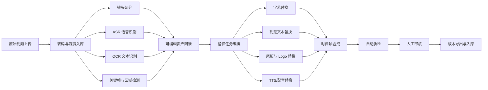

# 视频素材二创平台技术方案
> **适用公司**：AZSL / 艾泽 / AITRI
> **文档定位**：面向广告投放场景的视频素材二创专项技术方案
> **适用场景**：基于原始视频替换游戏名称、品牌名称、语音、字幕、尾板和局部视觉元素，并批量产出广告变体
> **核心原则**：优先做定点替换和半自动二创，不优先做整条纯文生视频重生成

---

## 一、背景、现状与问题

当前素材生产中，最常见的一类需求不是“从零生成一条全新视频”，而是基于已有原始视频快速做二创：

- 把视频中的游戏名称替换成另一个游戏名称
- 把品牌名称、品牌 Logo、尾板文案替换成另一个品牌版本
- 把原语音中提到的游戏名、品牌名替换成新的口播
- 把字幕、贴纸、CTA、活动文案做多语言或多版本改写
- 在不重拍素材的前提下，快速产出多个广告变体用于投放测试

如果继续依赖纯人工剪辑，通常会遇到几个问题：

- 改一个名称往往要重新找字幕、改画面、补配音、重新导出，人工链路长
- 同一条素材要适配多个游戏、多个品牌、多个国家时，版本数快速膨胀
- 品牌名和游戏名分散在字幕、语音、尾板、包装层甚至画面固化元素里，修改点不集中
- 人工交付质量不稳定，容易出现漏改、口播不同步、画面和字幕不一致
- 产能有限，难以支撑投放侧对大量变体的快速测试

因此，这个方案要解决的核心问题不是“能不能生成视频”，而是：

- 如何对原始视频做结构化理解
- 如何定位游戏名、品牌名、语音、字幕在视频中的具体位置
- 如何用尽量低成本的方式完成局部替换和自动合成
- 如何把二创过程沉淀成平台能力，而不是一次性剪辑项目

---

## 二、推荐结论

对当前阶段，最推荐的方案不是“全文生视频重做”，而是建设一套 **原始视频理解 + 定点替换 + 自动合成 + 人工质检** 的视频素材二创平台。

推荐结论如下：

1. 优先支持 `游戏名称`、`品牌名称`、`字幕`、`尾板`、`语音` 的定点替换
2. 视觉替换优先走 `文字覆盖`、`字幕替换`、`尾板重组`、`局部修补`，不优先走整条重生成
3. 语音替换优先支持 `TTS 重配` 和 `局部口播替换`，长音频重录或复杂口型同步放到后续阶段
4. 平台应默认支持“半自动”模式：自动识别和替换，关键结果由人工审核确认
5. 第一阶段重点做高频、可控、可批量的场景，不建议一开始覆盖所有复杂视频风格

一句话说：

**先把“原视频里需要替换的名字和语音”做成可识别、可编辑、可批量渲染的结构化链路，再考虑更重的文生视频能力。**

---

## 三、方案边界

### 3.1 本方案包含

- 原始视频上传、转码和媒资管理
- 镜头切分、字幕识别、语音识别、文本区域检测
- 游戏名称、品牌名称、Logo、尾板、字幕、口播的替换流程
- 多语言字幕和多语言语音的版本化输出
- 模板化批量导出多个视频变体
- 结果质检、人工审核和版本留痕
- 后续与投放平台、素材标签系统、效果回流系统的打通预留

### 3.2 本方案不包含

- 从零开始整条广告视频的纯文生视频生成
- 复杂三维角色、剧情视频和长篇品牌片生成
- 全自动无审核上线投放
- 完整的投放效果预测和素材算法排序系统
- 对所有剪辑风格和所有视频结构一次性全覆盖

### 3.3 当前阶段最推荐的对象

- 竖版短视频广告
- 15 到 45 秒内的视频素材
- 游戏名、品牌名、CTA 明确出现的广告素材
- 带字幕、尾板、口播的典型转化广告

### 3.4 当前阶段不推荐优先覆盖的对象

- 强剧情、强人物表演的视频
- 口型极其明显且需全程精准同步的真人口播
- 复杂特效合成、快速闪烁、文本与背景高度融合的画面
- 没有明确授权边界的第三方素材

### 3.5 本方案与纯文生视频方案的关系

这份方案会使用最新一批 AI 能力，但它不是“以整条文生视频为核心”的方案。

更准确地说，本方案属于 **混合式视频二创方案**，由 4 类能力共同组成：

- `理解类 AI`
  - 用于 ASR、OCR、镜头切分、文本区域识别、Logo 定位
- `编辑类 AI`
  - 用于字幕替换、局部覆盖、局部擦除与修补
- `生成类 AI`
  - 用于 TTS、局部图像生成、必要时的小段视频生成
- `编排类 AI`
  - 用于替换规划、术语映射、配音规则和质检辅助

因此，它和纯文生视频方案的区别是：

| 维度 | 本方案 | 纯文生视频方案 |
|------|------|------|
| 核心目标 | 基于原视频做定点替换和批量二创 | 从文本提示直接生成整条新视频 |
| 依赖素材 | 强依赖原始视频 | 可弱依赖或不依赖原始视频 |
| 可控性 | 高，便于精确替换品牌名和游戏名 | 中低，品牌和产品细节容易漂移 |
| 适合场景 | 改名、改字幕、改语音、改尾板 | 概念片、氛围片、补充镜头 |
| 当前落地性 | 高 | 中，质量和审核波动更大 |

对当前需求，优先采用本方案的原因是：

- 你们的核心需求是“替换”而不是“重拍”
- 原视频里已有真实产品、真实游戏画面和真实转化结构
- 品牌名、游戏名、尾板、口播这类元素更适合做局部编辑
- 直接整条重生成会带来品牌一致性、产品真实性和审核风险

一句话说：

**本方案吸收最新 AI 视频生成能力，但主架构仍以“原视频编辑链路”为核心，而不是“Prompt 直接出整条视频”为核心。**

---

## 四、方案设计

### 4.1 总体思路

平台的核心不是“生成一条新视频”，而是先把原始视频拆成一组可编辑对象：

- 镜头片段
- 语音片段
- 字幕片段
- 文本区域
- Logo 区域
- 尾板和包装层

然后围绕这些对象执行替换策略：

- `字幕替换`
- `屏幕文字覆盖`
- `局部擦除和重绘`
- `尾板重组`
- `TTS 重配`
- `音视频重新拼装`

### 4.2 核心业务链路



### 4.3 一级系统拆分

建议拆成 6 个一级系统：

1. `媒资接入与存储系统`
2. `视频理解与定位系统`
3. `替换编排与规则系统`
4. `生成与渲染系统`
5. `审核与质检系统`
6. `素材知识库与效果回流系统`

### 4.4 二级模块设计

#### 4.4.1 媒资接入与存储系统

负责原始视频、字幕、品牌包、配音素材和导出版本管理。

建议包含：

- 视频上传与断点续传
- 统一转码
- 封面和关键帧抽取
- 原素材、处理中间件、成片版本存储
- 品牌资产包管理
- 版本号、任务号和审核记录

核心对象建议包括：

- `source_video`
- `brand_asset_pack`
- `voice_profile`
- `subtitle_track`
- `render_version`

#### 4.4.2 视频理解与定位系统

负责把视频转成平台可编辑的结构化对象。

建议能力包括：

- 镜头切分
- ASR 语音转文本
- 字幕抽取或 OCR 识别
- 文本区域检测
- Logo 区域检测
- 时间轴对齐
- 关键帧提取
- 发音词典和别名识别

针对本需求，最关键的是识别以下几类元素：

- 语音里出现的游戏名和品牌名
- 画面字幕里出现的游戏名和品牌名
- 尾板或片尾中的品牌信息
- 画面内固化文字或 Logo

建议输出统一的“可编辑片段”结构：

| 字段 | 说明 |
|------|------|
| `segment_id` | 片段唯一标识 |
| `segment_type` | `speech` / `subtitle` / `overlay_text` / `logo` / `end_card` |
| `start_ms` | 开始时间 |
| `end_ms` | 结束时间 |
| `text_content` | 当前文本内容 |
| `bbox` | 区域位置，非画面类可为空 |
| `confidence` | 识别置信度 |
| `editable_mode` | `replace_text` / `overlay` / `inpaint` / `redub` |

#### 4.4.3 替换编排与规则系统

负责把“原始素材”与“目标品牌/目标游戏”映射成可执行的替换任务。

建议输入：

- 原始视频
- 原始游戏名 / 品牌名
- 目标游戏名 / 品牌名
- 替换词典
- 多语言规则
- 目标语音风格
- 输出版本模板

建议支持的替换策略优先级：

1. `字幕替换`
2. `尾板和包装层重组`
3. `覆盖式文本替换`
4. `局部擦除后重绘`
5. `局部语音重配`
6. `整段语音重配`

建议内置规则：

- 品牌敏感词与禁用词规则
- 名称缩写、别名、大小写规则
- 发音词典规则
- 字幕长度和换行规则
- 不同语种的文本扩缩规则
- 输出平台比例和时长规则

#### 4.4.4 生成与渲染系统

这是平台最核心的执行引擎。

建议拆分为 4 类能力：

1. `视觉替换`
   - 适合字幕、贴纸、尾板、可覆盖文本
2. `局部修补`
   - 适合画面中已烙死的文字、Logo、标题
3. `语音生成`
   - 适合品牌名、游戏名替换后的口播更新
4. `时间轴合成`
   - 负责音视频重新拼装、混音、导出

视觉替换建议分三档：

- `A 档：直接替换`
  - 原素材本身有字幕轨或模板层
  - 成本最低，效果最稳定
- `B 档：覆盖替换`
  - 在原区域上做遮罩、跟踪和新文案覆盖
  - 适合中高频广告包装素材
- `C 档：局部擦除与重绘`
  - 适合文本已经嵌入画面，需要做 inpaint 或生成式修补
  - 成本和风险最高，应后置

语音替换建议分三档：

- `A 档：局部 TTS 拼接`
  - 只替换包含品牌名、游戏名的短语
- `B 档：整句 TTS 重配`
  - 当前句子整体重配，减少音色断裂
- `C 档：整段重配或口型同步`
  - 风险高，放后续

#### 4.4.5 审核与质检系统

这一步必须保留，不能省略。

建议质检项包括：

- 画面中的旧品牌名是否已全部替换
- 字幕中的旧品牌名是否已全部替换
- 语音中的旧品牌名是否已全部替换
- 语音和字幕是否一致
- 音频时长是否与画面节奏匹配
- 字体、颜色、Logo 是否符合品牌包规范
- 导出比例、分辨率、码率是否合规
- 是否存在 AI 修补痕迹明显、语音断裂、音量异常

建议审核方式：

- 自动质检先筛
- 高风险项打标
- 人工只看风险片段和最终成片

#### 4.4.6 素材知识库与效果回流系统

第一阶段不需要做复杂算法，但应预留回流结构。

建议沉淀：

- 该素材替换了哪些元素
- 哪种替换方式成功率更高
- 哪种语音风格更稳定
- 哪种尾板模板更适合不同游戏
- 哪个版本最终上线投放，效果如何

后续可用于：

- 自动推荐替换策略
- 自动推荐语音模板
- 自动推荐 CTA 和尾板样式
- 高表现素材模式总结

---

## 五、关键场景拆解

### 5.1 替换游戏名称

最常见位置：

- 口播中的游戏名
- 字幕中的游戏名
- 尾板中的游戏名
- 画面标题或 UI 包装中的游戏名

推荐做法：

- 语音侧优先做关键词定位和整句重配
- 字幕侧优先走字幕轨替换或 OCR 后重排
- 尾板侧优先模板化重组
- 画面固化文字优先使用局部遮罩覆盖，复杂场景再做 inpaint

### 5.2 替换品牌名称

最常见位置：

- 口播中的品牌名
- 片头/片尾品牌露出
- 画面中的品牌 Logo
- CTA、下载引导、活动包装中的品牌文案

推荐做法：

- 品牌名和品牌 Logo 统一从 `brand_asset_pack` 读取
- 语音替换要结合品牌发音词典
- 视觉替换要校验字体、颜色、留白和安全边距
- 品牌审核应提高优先级，默认要求人工确认

### 5.3 替换语音

语音替换要分清三种情况：

1. 原语音可直接删除并重新配整句
2. 原语音只需替换局部词汇
3. 原视频有人物口型，替换后会带来明显口型不一致

推荐结论：

- 第一阶段优先支持旁白型、解说型语音
- 第一阶段不优先支持强口型真人出镜视频
- 先保证“听感自然、时长对齐、品牌名发音正确”，再考虑高级口型同步

### 5.4 多语言版本化

这一能力价值很高，但应分阶段。

第一阶段建议支持：

- 原文字幕替换
- 目标语言字幕生成
- 目标语言 TTS
- 统一尾板模板

后续再做：

- 多语言品牌词典
- 多语种发音校正
- 多语言本地化包装素材模板

---

## 六、推荐技术选型

### 6.1 总体选型建议

对当前阶段，更推荐：

- 编排和平台服务层使用 `Python + FastAPI`
- 媒体处理使用 `FFmpeg`
- 任务调度使用 `Celery` 或 `Temporal`
- 结构化数据使用 `PostgreSQL`
- 缓存和任务状态使用 `Redis`
- 大文件使用 `S3/OSS` 兼容对象存储
- 模型层采用“开源模型 + 第三方 API 混合模式”

原因是：

- Python 对音视频、ASR、OCR、CV、AIGC 生态最成熟
- 现阶段模型能力迭代快，混合模式比纯自建更灵活
- 先做平台编排和审核流程，比一开始重投入自研生成模型更划算

### 6.2 推荐技术栈

| 层级 | 推荐技术 | 说明 |
|------|----------|------|
| API / 平台服务 | `Python + FastAPI` | 编排、任务、审核、素材管理 |
| 媒体处理 | `FFmpeg` | 转码、抽帧、裁剪、混音、导出 |
| ASR | `Whisper` 或商用 ASR API | 语音转文本和时间戳 |
| OCR | `PaddleOCR` 或商用 OCR API | 字幕、画面文本识别 |
| 区域检测 | `GroundingDINO`、`SAM`、OCR bbox | 文本和 Logo 区域定位 |
| TTS | `CosyVoice`、`Fish Speech`、`ElevenLabs` 等 | 品牌名、游戏名重配 |
| 图像修补 | 开源 inpaint 模型或商用生成 API | 文本擦除和局部重绘 |
| 调度 | `Celery` / `Temporal` | 长任务、重试、队列 |
| 数据库 | `PostgreSQL` | 任务、版本、审核记录 |
| 缓存 | `Redis` | 状态机、限流、队列辅助 |
| 存储 | `MinIO` / `S3` / `OSS` | 视频、关键帧、导出文件 |

### 6.3 模型使用建议

建议把模型分成三类，不要混用职责：

- `理解模型`
  - 用于 ASR、OCR、镜头切分、区域检测
- `生成模型`
  - 用于 TTS、局部图像修补、必要的局部视频生成
- `规则与编排模型`
  - 用于脚本改写、替换规划、审核辅助

当前阶段不推荐：

- 自研视频生成大模型
- 过度依赖整条视频生成 API
- 在没有审核链路前直接批量自动导出上线

### 6.4 最新 AI 视频生成技术在本方案中的适用位置

如果后续要接入最新的 AI 文生视频、图生视频或视频编辑模型，更适合放在下列位置，而不是替代整条主链路：

#### 6.4.1 适合优先接入的位置

- `尾板背景生成`
  - 用于快速适配不同品牌、活动和国家版本
- `局部文本擦除后的背景补全`
  - 用于处理画面中已经烙死的品牌名或游戏名
- `补充过场镜头`
  - 用于缺少 B-roll、转场或氛围镜头时补素材
- `局部包装层生成`
  - 用于生成贴纸、装饰层、提示框、CTA 包装背景
- `语音驱动的轻量数字人口播`
  - 仅适合弱口型、弱写实要求的场景

#### 6.4.2 不适合当前阶段优先接入的位置

- `整条广告视频重生成`
- `高一致性产品演示镜头替换`
- `强真人口型同步的长段视频`
- `需要精确保留游戏 UI 和品牌细节的主镜头`

#### 6.4.3 接入原则

- 生成模型只处理“原素材无法低成本修改”的部分
- 能用模板、覆盖、重组解决的问题，不优先使用生成模型
- 生成结果必须进入自动质检和人工审核链路
- 生成能力应作为可插拔模块，不应绑死某一家模型厂商

#### 6.4.4 阶段性建议

- `MVP`
  - 只用理解类 AI 和 TTS，不强依赖视频生成模型
- `第一阶段标准版`
  - 增加局部 inpaint 和尾板背景生成
- `后续增强版`
  - 再评估图生视频、视频编辑模型和轻量数字人能力

这样设计的好处是：

- 先把高频需求做稳
- 控制模型成本和审核成本
- 保留未来接入最新视频生成模型的扩展性
- 避免方案在早期被高不确定性的整条生成能力拖慢

---

## 七、核心数据结构建议

建议至少沉淀以下几类核心实体：

| 实体 | 作用 |
|------|------|
| `source_video` | 原始视频主表 |
| `video_scene` | 镜头切分结果 |
| `editable_segment` | 可编辑片段，统一承载字幕、语音、Logo、尾板等 |
| `brand_asset_pack` | 品牌包，包括 Logo、色板、字体、术语 |
| `voice_profile` | 配音风格、语言、发音规则 |
| `replacement_project` | 一次二创项目 |
| `replacement_rule_set` | 替换词典、规则、禁用词、发音词典 |
| `render_task` | 渲染任务 |
| `qa_result` | 自动质检结果 |
| `review_record` | 人工审核记录 |
| `render_version` | 输出成片版本 |

建议保留的关键字段：

- 原始文本
- 替换后文本
- 原始音频位置
- 替换后音频文件
- 原始区域 bbox
- 使用的替换策略
- 使用的字体、音色、模板版本
- 自动质检分数
- 最终审核结论

---

## 八、资源、成本与收益评估

### 8.1 人力投入建议

MVP 阶段建议最少配置：

- `产品/方案`：0.5 人月
- `后端工程师`：1 人月
- `AI/多媒体工程师`：1 到 1.5 人月
- `前端工程师`：0.5 到 1 人月
- `测试/运营验收`：0.5 人月

合计建议：

- `3.5 到 4.5 人月` 可完成一个可运行 MVP

第一阶段标准版建议：

- `5 到 7 人月`

### 8.2 基础设施投入

MVP 阶段建议配置：

- `应用服务器`：2 台通用型服务，承载 API、调度和审核后台
- `对象存储`：用于视频、关键帧、中间文件和导出版本
- `PostgreSQL`：任务和版本元数据
- `Redis`：队列和状态缓存
- `GPU 机器`：1 台 24GB 显存级别的中等 GPU 机器，用于 ASR、TTS、局部生成或推理
- `CPU 转码节点`：1 到 2 台，负责 FFmpeg 转码和导出

### 8.2.1 成本估算前提

下面的成本区间按以下假设估算：

- 日常处理以 `15 到 45 秒` 的短视频广告为主
- 月处理原视频量约 `300 到 1000` 条
- 每条视频平均导出 `3 到 5` 个版本
- 当前阶段以 `ASR + OCR + TTS + 简单覆盖替换 + 少量局部修补` 为主
- 不把“大量整条视频生成”和“高并发实时出片”纳入当前阶段

如果后续视频量、导出版本数或生成式修补占比明显上升，GPU、带宽和对象存储成本都会明显上升。

### 8.2.2 GPU 要求与推荐档位

对当前方案，GPU 不是用来训练大模型，而主要用于：

- `ASR` 推理
- `TTS` 推理
- `OCR/CV` 相关推理
- `局部 inpaint` 或局部生成
- 少量多任务并行处理

当前阶段建议的 GPU 选择如下：

| 档位 | 推荐规格 | 显存建议 | 适用场景 | 月费区间 |
|------|----------|----------|----------|----------|
| `MVP 最低可用` | `RTX 4090` 或同级 | `24GB` | 单机推理、低并发 ASR/TTS、少量局部修补 | 自建折算约 `2000 到 4000 元/月`，云上约 `4000 到 8000 元/月` |
| `MVP 推荐` | `L4 / A10` 或同级 | `24GB` | 更稳定的生产推理、较好的兼容性、适合白天批处理 | 云上约 `5000 到 12000 元/月` |
| `第一阶段标准版` | `2 x L4`、`2 x A10` 或 `1 x 48GB` 级别 | `48GB` 左右总显存 | 多任务并行、局部生成比例提升、批量出片 | 云上约 `10000 到 25000 元/月` |
| `后续增强版` | `A100 40GB/80GB` 或更高 | `40GB+` | 更重的视频编辑模型、较高并发、复杂生成任务 | 云上约 `18000 到 50000 元/月` |

推荐结论：

- `MVP` 阶段优先选 `24GB` 显存档位即可
- 如果主要依赖第三方 ASR/TTS API，本地 GPU 压力会更小
- 当前阶段 **不建议** 为这个方案直接上 `H100` 这类高端训练级 GPU

### 8.2.3 GPU 规格如何判断是否够用

可以按任务类型来理解：

- `ASR`
  - `16GB` 以上即可跑通，`24GB` 更稳，适合批处理
- `TTS`
  - `8GB 到 16GB` 常可运行，但为多模型并行建议 `24GB`
- `OCR / 文本区域检测`
  - 对显存要求不高，更多消耗在 CPU 和图像处理链路
- `局部 inpaint / 局部生成`
  - 建议 `24GB` 起步，效果和稳定性明显好于 `12GB` 档位
- `多任务并行`
  - 如果要同时跑 ASR、TTS、局部修补，`24GB` 是更合理的下限

一句话说：

**如果只是做字幕、语音和简单包装替换，`24GB` 显存够用；如果局部生成比例上来，建议尽快升到 `48GB` 左右总显存。**

### 8.2.4 其他基础设施成本区间

按云上月付方式，MVP 阶段可粗略按下列量级估算：

| 资源 | 建议规格 | 月费区间 |
|------|----------|----------|
| `应用服务器` | `2 台 4C8G` 或 `8C16G` 混合 | `800 到 2500 元/月` |
| `CPU 转码节点` | `1 到 2 台 8C16G` 或 `16C32G` | `1000 到 4000 元/月` |
| `PostgreSQL` | 托管版 `2C4G` 到 `4C8G` + `100GB` 存储 | `500 到 2000 元/月` |
| `Redis` | `1GB` 到 `4GB` 托管版 | `100 到 600 元/月` |
| `对象存储` | `1TB` 到 `3TB` | `200 到 1500 元/月`，不含大流量外网下行 |
| `CDN / 带宽 / 下载流量` | 按导出和回看量浮动 | `500 到 5000 元/月` |
| `日志监控` | 基础云监控 + 日志服务 | `200 到 1500 元/月` |

### 8.2.5 两种推荐部署方式

可以按当前阶段在两种模式之间选：

#### 方案 A：自建单卡工作站 + 云上通用服务

适合：

- 团队前期验证
- 模型调用量还不高
- 希望降低长期 GPU 租赁费用

成本特点：

- `一次性硬件投入` 较高
- `月度现金成本` 较低
- 运维、稳定性和备机能力较弱

建议理解为：

- 一台 `4090 24GB` 工作站 + 云上 API/数据库/存储
- 更适合内部 MVP 验证

#### 方案 B：云上 GPU + 云上服务

适合：

- 想快速上线
- 需要弹性扩容
- 更关注稳定性和交付速度

成本特点：

- 月租更高
- 上线更快
- 更适合标准版和多人协作环境

建议理解为：

- 一台 `L4/A10 24GB` 云 GPU + 云上数据库/缓存/对象存储
- 更适合生产环境起步

### 8.2.6 月度总成本估算

按当前阶段，更推荐把总成本分成两个口径：

| 方案 | 月度基础设施成本 |
|------|------------------|
| `MVP-自建 GPU` | 约 `5000 到 15000 元/月`，另加一次性工作站采购 |
| `MVP-云上 GPU` | 约 `9000 到 25000 元/月` |
| `第一阶段标准版` | 约 `18000 到 50000 元/月` |

这里的差异主要来自：

- GPU 档位差异
- 月处理视频量差异
- 是否使用大量第三方 API
- 带宽和导出文件量差异
- 局部生成和修补占比差异

### 8.3 第三方成本

主要成本变量：

- TTS API 或语音克隆服务费用
- OCR / ASR 商用 API 费用
- 局部修补或生成式 API 费用
- 对象存储和带宽费用
- 视频转码和 GPU 推理成本

按当前阶段的量级，可先按以下方式理解：

- `一次性建设成本`：主要是研发人力投入
- `月度运行成本`：主要受视频时长、导出版本数、TTS 量、OCR/ASR 调用量影响

如果采用“混合模式”：

- `MVP 月度运行成本`：可控制在中低到中等量级
- 如果大量使用第三方 TTS、商用 OCR/ASR 和局部生成 API，第三方费用可能与 GPU 成本接近
- 复杂局部生成越多，成本越高

### 8.4 直接收益

- 单条素材改名、改口播、改尾板的处理时间显著下降
- 同一条素材可更快产出多个投放版本
- 人工剪辑对个体经验的依赖下降
- 漏改、错改、字幕语音不一致的问题减少

### 8.5 间接收益

- 沉淀品牌包、发音词典、替换规则等长期资产
- 为后续素材分析、素材推荐、效果回流和算法优化提供结构化底座
- 为多品牌、多游戏、多语言投放建立统一生产流程

### 8.6 投入产出判断

对当前阶段，这个方向 **值得做，但应按 MVP 方式推进**。

原因是：

- 需求高频且明确
- 结果可以直接服务素材投放
- 相比“整条 AI 生成视频”，定点替换更可控、交付更快、风险更低
- 产出的结构化数据后续还能反哺素材平台和投放平台

---

## 九、MVP 与实施路径

### 9.1 MVP 范围

第一阶段建议只覆盖最有价值、最稳定的能力：

1. 上传原始视频并入库
2. 自动做镜头切分、ASR、OCR
3. 自动识别字幕、尾板、品牌名、游戏名候选位置
4. 支持以下替换方式：
   - 字幕替换
   - 尾板文字和 Logo 替换
   - 局部口播整句重配
   - 简单覆盖式画面文字替换
5. 支持人工确认替换结果
6. 支持导出 3 到 5 个版本
7. 全流程留痕和审核记录

MVP 明确不做：

- 复杂口型同步
- 长剧情视频处理
- 整条视频生成
- 高难度嵌入式文本全自动修补

### 9.2 推荐实施顺序

#### 阶段 A：半自动 MVP

目标：

- 跑通从上传到导出的一条主链路
- 重点处理尾板、字幕、简单口播替换

建议周期：

- `4 到 6 周`

#### 阶段 B：标准版

目标：

- 增加区域检测、局部修补、批量任务、品牌包和多语言支持

建议周期：

- `8 到 10 周`

#### 阶段 C：增强版

目标：

- 增加复杂视频支持、素材效果回流、替换策略推荐和更强自动化

建议周期：

- `3 到 4 个月`

### 9.3 最小可运行链路

```text
上传原视频
-> 转码与抽帧
-> ASR/OCR/镜头切分
-> 识别游戏名/品牌名出现位置
-> 生成替换计划
-> 重配语音、替换字幕、替换尾板
-> 自动导出
-> 自动质检
-> 人工审核
-> 入库成片版本
```

---

## 十、风险、依赖与暂不纳入范围

### 10.1 主要风险

- 原视频中的文字和背景高度融合，自动替换效果不稳定
- 品牌名替换后语音时长变化过大，导致节奏错位
- 同一条素材中旧品牌名出现位置分散，可能存在漏改
- 真人口播视频存在明显口型不匹配风险
- 字体授权、品牌授权、素材版权边界需要提前确认
- 商用模型 API 的价格和效果存在波动

### 10.2 关键依赖

- 可用的品牌资产包
- 品牌名和游戏名词典
- 发音词典和配音风格配置
- 稳定的视频上传和转码能力
- 人工审核流程和验收标准

### 10.3 暂不纳入范围

- 广告投放自动上线
- 素材效果自动决策
- 自研基础模型
- 强实时视频处理

---

## 十一、最终建议

- 当前阶段优先做“定点替换平台”，不优先做“整条纯文生视频平台”
- MVP 先聚焦 `游戏名`、`品牌名`、`字幕`、`尾板`、`语音` 这五类高频替换对象
- 视觉替换优先级应是：`字幕/尾板` > `覆盖替换` > `局部修补`
- 语音替换优先级应是：`整句重配` > `局部拼接` > `复杂口型同步`
- 默认保留人工审核，不建议直接全自动出片上线
- 后续如果要继续扩展，优先增加多语言、品牌包、批量任务和效果回流，不建议过早重投入整条视频生成
